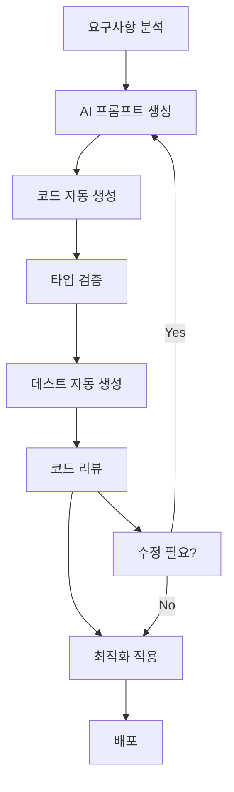

# 🤖 AI 최적화 온라인 평가 시스템 React 구현 메뉴얼

> **AI 코더를 위한 완전 자동화 개발 가이드**  
> 이 메뉴얼은 AI 코드 생성, 자동 리팩토링, 지능형 디버깅을 위해 최적화되었습니다.

## 📋 목차

### 🎯 AI 개발 최적화 섹션
1. [AI 코드 생성 가이드](#ai-코드-생성-가이드)
2. [TypeScript 인터페이스 정의](#typescript-인터페이스-정의)
3. [코드 패턴 라이브러리](#코드-패턴-라이브러리)
4. [AI 프롬프트 템플릿](#ai-프롬프트-템플릿)

### 🏗️ 기본 구현 섹션
5. [프로젝트 초기 설정](#프로젝트-초기-설정)
6. [핵심 구조 및 설정](#핵심-구조-및-설정)
7. [API 서비스 레이어](#api-서비스-레이어)
8. [상태 관리 (Context API)](#상태-관리-context-api)
9. [공통 컴포넌트](#공통-컴포넌트)
10. [레이아웃 컴포넌트](#레이아웃-컴포넌트)
11. [페이지 컴포넌트](#페이지-컴포넌트)
12. [라우팅 설정](#라우팅-설정)
13. [커스텀 훅](#커스텀-훅)
14. [유틸리티 함수](#유틸리티-함수)
15. [스타일링 설정](#스타일링-설정)

### 🚀 고급 기능 섹션
16. [성능 최적화 패턴](#성능-최적화-패턴)
17. [테스트 자동화](#테스트-자동화)
18. [AI 개발 워크플로우](#ai-개발-워크플로우)
19. [구현 순서 가이드](#구현-순서-가이드)

---

## AI 코드 생성 가이드

### 🤖 AI 개발 환경 설정

#### 필수 AI 도구 설치
```bash
# AI 코드 생성 및 최적화 도구
npm install -D @typescript-eslint/parser @typescript-eslint/eslint-plugin
npm install -D prettier eslint-plugin-prettier
npm install -D husky lint-staged
npm install -D @storybook/react @storybook/addon-docs
npm install -D plop # 코드 제너레이터

# AI 친화적 개발 도구
npm install -D @types/react @types/react-dom
npm install -D typescript
npm install -D @testing-library/jest-dom @testing-library/react @testing-library/user-event
```

#### AI 코드 생성을 위한 설정 파일들

**`.eslintrc.js` - AI 코드 품질 검증**
```javascript
module.exports = {
  parser: '@typescript-eslint/parser',
  extends: [
    'react-app',
    '@typescript-eslint/recommended',
    'prettier/@typescript-eslint',
    'plugin:prettier/recommended'
  ],
  rules: {
    // AI 코드 생성 최적화 규칙
    '@typescript-eslint/explicit-function-return-type': 'warn',
    '@typescript-eslint/no-explicit-any': 'error',
    'react-hooks/exhaustive-deps': 'warn',
    'prefer-const': 'error',
    'no-var': 'error'
  }
};
```

**`plopfile.js` - AI 코드 제너레이터**
```javascript
module.exports = function (plop) {
  // React 컴포넌트 자동 생성
  plop.setGenerator('component', {
    description: 'AI 최적화 React 컴포넌트 생성',
    prompts: [
      {
        type: 'input',
        name: 'name',
        message: '컴포넌트 이름을 입력하세요:'
      },
      {
        type: 'list',
        name: 'type',
        message: '컴포넌트 타입을 선택하세요:',
        choices: ['common', 'page', 'form', 'layout']
      }
    ],
    actions: [
      {
        type: 'add',
        path: 'src/components/{{type}}/{{pascalCase name}}.tsx',
        templateFile: 'plop-templates/component.hbs'
      },
      {
        type: 'add',
        path: 'src/components/{{type}}/{{pascalCase name}}.test.tsx',
        templateFile: 'plop-templates/component.test.hbs'
      }
    ]
  });

  // API 서비스 자동 생성
  plop.setGenerator('service', {
    description: 'AI 최적화 API 서비스 생성',
    prompts: [
      {
        type: 'input',
        name: 'name',
        message: '서비스 이름을 입력하세요:'
      }
    ],
    actions: [
      {
        type: 'add',
        path: 'src/services/{{camelCase name}}.ts',
        templateFile: 'plop-templates/service.hbs'
      }
    ]
  });
};
```

---

## TypeScript 인터페이스 정의

### 🎯 완전한 타입 정의 시스템

#### 핵심 데이터 타입 (types/index.ts)
```typescript
// ================================
// AI 코드 생성용 기본 타입 정의
// ================================

export interface BaseEntity {
  id: string;
  created_at: string;
  updated_at?: string;
}

export interface User extends BaseEntity {
  login_id: string;
  user_name: string;
  email: string;
  phone?: string;
  role: UserRole;
  is_active: boolean;
  last_login?: string;
}

export type UserRole = 'admin' | 'secretary' | 'evaluator';

export interface Project extends BaseEntity {
  name: string;
  description: string;
  deadline: string;
  created_by: string;
  is_active: boolean;
  total_companies: number;
  total_evaluations: number;
  completed_evaluations: number;
}

export interface Company extends BaseEntity {
  name: string;
  project_id: string;
  description?: string;
}

export interface EvaluationTemplate extends BaseEntity {
  name: string;
  description: string;
  project_id: string;
  items: EvaluationItem[];
  created_by: string;
  is_active: boolean;
}

export interface EvaluationItem {
  id: string;
  title: string;
  description: string;
  score_type: ScoreType;
  max_score: number;
  weight: number;
}

export type ScoreType = 'numeric' | 'percentage' | 'rating';

export interface EvaluationSheet extends BaseEntity {
  evaluator_id: string;
  company_id: string;
  project_id: string;
  template_id: string;
  status: EvaluationStatus;
  scores: EvaluationScore[];
  total_score?: number;
  submitted_at?: string;
  deadline?: string;
  overall_comment?: string;
}

export type EvaluationStatus = 'draft' | 'submitted';

export interface EvaluationScore {
  item_id: string;
  score: number;
  comment?: string;
}

// ================================
// API 응답 타입
// ================================

export interface ApiResponse<T> {
  data: T;
  message?: string;
  success: boolean;
}

export interface PaginatedResponse<T> {
  items: T[];
  total: number;
  page: number;
  per_page: number;
  total_pages: number;
}

export interface LoginResponse {
  access_token: string;
  token_type: string;
  user: User;
}

// ================================
// 컴포넌트 Props 타입
// ================================

export interface ButtonProps {
  children: React.ReactNode;
  variant?: 'primary' | 'secondary' | 'success' | 'warning' | 'danger' | 'outline';
  size?: 'xs' | 'sm' | 'base' | 'lg' | 'xl';
  loading?: boolean;
  disabled?: boolean;
  type?: 'button' | 'submit' | 'reset';
  onClick?: () => void;
  className?: string;
}

export interface InputProps {
  label?: string;
  type?: string;
  placeholder?: string;
  value: string;
  onChange: (e: React.ChangeEvent<HTMLInputElement>) => void;
  error?: string;
  required?: boolean;
  disabled?: boolean;
  className?: string;
}

export interface ModalProps {
  isOpen: boolean;
  onClose: () => void;
  title?: string;
  children: React.ReactNode;
  size?: 'sm' | 'md' | 'lg' | 'xl' | 'full';
  showCloseButton?: boolean;
  closeOnOverlayClick?: boolean;
}

export interface TableColumn<T> {
  header: string;
  accessor: keyof T;
  render?: (value: any, row: T) => React.ReactNode;
  sortable?: boolean;
  width?: string;
}

export interface TableProps<T> {
  columns: TableColumn<T>[];
  data: T[];
  loading?: boolean;
  emptyMessage?: string;
  onSort?: (column: keyof T) => void;
  sortColumn?: keyof T;
  sortDirection?: 'asc' | 'desc';
  className?: string;
}

// ================================
// 상태 관리 타입
// ================================

export interface AuthContextType {
  user: User | null;
  loading: boolean;
  login: (credentials: LoginCredentials) => Promise<User>;
  logout: () => void;
  checkAuthStatus: () => Promise<void>;
  hasRole: (role: UserRole) => boolean;
  hasAnyRole: (roles: UserRole[]) => boolean;
}

export interface AppContextType {
  projects: Project[];
  selectedProject: Project | null;
  sidebarOpen: boolean;
  setProjects: (projects: Project[]) => void;
  setSelectedProject: (project: Project | null) => void;
  setSidebarOpen: (open: boolean) => void;
  addProject: (project: Project) => void;
  updateProject: (project: Project) => void;
  removeProject: (projectId: string) => void;
}

export interface NotificationContextType {
  notifications: Notification[];
  addNotification: (notification: Omit<Notification, 'id'>) => void;
  removeNotification: (id: number) => void;
  clearNotifications: () => void;
}

export interface Notification {
  id: number;
  type: 'success' | 'error' | 'warning' | 'info';
  title: string;
  message: string;
  duration?: number;
}

// ================================
// 폼 및 검증 타입
// ================================

export interface LoginCredentials {
  username: string;
  password: string;
}

export interface ProjectFormData {
  name: string;
  description: string;
  deadline: string;
}

export interface UserFormData {
  login_id: string;
  password: string;
  user_name: string;
  email: string;
  role: UserRole;
  phone?: string;
}

export interface EvaluationFormData {
  sheet_id: string;
  scores: EvaluationScore[];
  overall_comment?: string;
}

export interface ValidationRule {
  validator: (value: any) => boolean;
  message: string;
}

export interface FormErrors {
  [key: string]: string;
}

// ================================
// 커스텀 훅 타입
// ================================

export interface UseApiCallResult<T> {
  data: T | null;
  loading: boolean;
  error: string | null;
  execute: (...args: any[]) => Promise<T>;
  reset: () => void;
}

export interface UseFormResult<T> {
  values: T;
  errors: FormErrors;
  touched: { [K in keyof T]?: boolean };
  handleChange: (field: keyof T) => (e: React.ChangeEvent<HTMLInputElement>) => void;
  handleSubmit: (onSubmit: (values: T) => void) => (e: React.FormEvent) => void;
  setFieldValue: (field: keyof T, value: any) => void;
  setFieldError: (field: keyof T, error: string) => void;
  reset: () => void;
  isValid: boolean;
}

// ================================
// 차트 및 분석 타입
// ================================

export interface ChartData {
  labels: string[];
  datasets: ChartDataset[];
}

export interface ChartDataset {
  label: string;
  data: number[];
  backgroundColor?: string | string[];
  borderColor?: string | string[];
  borderWidth?: number;
}

export interface AnalyticsData {
  project_id: string;
  total_companies: number;
  companies_evaluated: number;
  total_evaluations: number;
  completion_rate: number;
  score_analytics: { [templateName: string]: ScoreAnalytics };
}

export interface ScoreAnalytics {
  average: number;
  min: number;
  max: number;
  count: number;
}

// ================================
// 라우팅 타입
// ================================

export interface RouteConfig {
  path: string;
  component: React.ComponentType;
  roles?: UserRole[];
  exact?: boolean;
}

export interface NavigationItem {
  name: string;
  href: string;
  icon: React.ComponentType<{ className?: string }>;
  roles?: UserRole[];
}
```

---

## 코드 패턴 라이브러리

### 🎨 재사용 가능한 코드 패턴

#### 1. AI 최적화 컴포넌트 템플릿
```typescript
// ===========================================
// AI 코드 생성용 표준 컴포넌트 템플릿
// 이 패턴을 기반으로 모든 컴포넌트를 생성하세요
// ===========================================

import React, { useState, useEffect, useCallback, useMemo } from 'react';
import { ComponentProps } from '../types';

interface Props extends ComponentProps {
  // AI가 쉽게 이해할 수 있도록 명시적 타입 정의
  data: any[];
  loading?: boolean;
  error?: string;
  onAction?: (item: any) => void;
}

/**
 * AI 최적화 컴포넌트
 * 
 * @description 이 컴포넌트는 [구체적인 기능 설명]을 담당합니다
 * @param props - 컴포넌트 속성
 * @returns JSX.Element
 * 
 * @example
 * ```tsx
 * <ComponentName 
 *   data={items}
 *   loading={false}
 *   onAction={handleAction}
 * />
 * ```
 */
const ComponentName: React.FC<Props> = ({
  data,
  loading = false,
  error,
  onAction,
  className = ''
}) => {
  // ===============================
  // 상태 관리 (AI 패턴 인식용)
  // ===============================
  const [localState, setLocalState] = useState<any>(null);
  
  // ===============================
  // 메모이제이션 (성능 최적화)
  // ===============================
  const processedData = useMemo(() => {
    if (!data) return [];
    return data.map(item => ({
      ...item,
      // 데이터 가공 로직
    }));
  }, [data]);
  
  // ===============================
  // 이벤트 핸들러 (useCallback 최적화)
  // ===============================
  const handleClick = useCallback((item: any) => {
    if (onAction) {
      onAction(item);
    }
  }, [onAction]);
  
  // ===============================
  // 부수 효과 (생명주기)
  // ===============================
  useEffect(() => {
    // 컴포넌트 마운트 시 실행할 로직
    return () => {
      // 클린업 로직
    };
  }, []);
  
  // ===============================
  // 조건부 렌더링 (로딩/에러 상태)
  // ===============================
  if (loading) {
    return <div className="animate-pulse">로딩 중...</div>;
  }
  
  if (error) {
    return <div className="text-red-600">오류: {error}</div>;
  }
  
  if (!data || data.length === 0) {
    return <div className="text-gray-500">데이터가 없습니다.</div>;
  }
  
  // ===============================
  // 메인 렌더링
  // ===============================
  return (
    <div className={`component-container ${className}`}>
      {processedData.map((item, index) => (
        <div key={item.id || index} onClick={() => handleClick(item)}>
          {/* 렌더링 로직 */}
        </div>
      ))}
    </div>
  );
};

export default ComponentName;
```

#### 2. AI 최적화 커스텀 훅 패턴
```typescript
// ===========================================
// AI 코드 생성용 표준 커스텀 훅 템플릿
// ===========================================

import { useState, useEffect, useCallback, useRef } from 'react';
import { UseApiCallResult } from '../types';

/**
 * AI 최적화 커스텀 훅
 * 
 * @description [훅의 구체적인 기능 설명]
 * @param initialValue - 초기값
 * @returns 훅 실행 결과
 * 
 * @example
 * ```tsx
 * const { data, loading, execute } = useCustomHook(initialValue);
 * ```
 */
export const useCustomHook = <T>(
  apiCall: (...args: any[]) => Promise<T>,
  dependencies: any[] = []
): UseApiCallResult<T> => {
  // ===============================
  // 상태 정의 (명시적 타입)
  // ===============================
  const [data, setData] = useState<T | null>(null);
  const [loading, setLoading] = useState<boolean>(false);
  const [error, setError] = useState<string | null>(null);
  
  // ===============================
  // Ref를 사용한 메모리 누수 방지
  // ===============================
  const isMountedRef = useRef<boolean>(true);
  
  // ===============================
  // 안전한 상태 업데이트 함수
  // ===============================
  const safeSetState = useCallback((updater: () => void) => {
    if (isMountedRef.current) {
      updater();
    }
  }, []);
  
  // ===============================
  // 메인 실행 함수
  // ===============================
  const execute = useCallback(async (...args: any[]): Promise<T> => {
    safeSetState(() => {
      setLoading(true);
      setError(null);
    });
    
    try {
      const result = await apiCall(...args);
      
      safeSetState(() => {
        setData(result);
        setLoading(false);
      });
      
      return result;
    } catch (err) {
      const errorMessage = err instanceof Error ? err.message : '알 수 없는 오류';
      
      safeSetState(() => {
        setError(errorMessage);
        setLoading(false);
      });
      
      throw err;
    }
  }, [apiCall, safeSetState, ...dependencies]);
  
  // ===============================
  // 리셋 함수
  // ===============================
  const reset = useCallback(() => {
    safeSetState(() => {
      setData(null);
      setError(null);
      setLoading(false);
    });
  }, [safeSetState]);
  
  // ===============================
  // 클린업
  // ===============================
  useEffect(() => {
    return () => {
      isMountedRef.current = false;
    };
  }, []);
  
  return { data, loading, error, execute, reset };
};
```

#### 3. AI 최적화 폼 관리 패턴
```typescript
// ===========================================
// AI 코드 생성용 폼 관리 훅
// ===========================================

import { useState, useCallback } from 'react';
import { UseFormResult, FormErrors, ValidationRule } from '../types';

/**
 * AI 최적화 폼 관리 훅
 * 
 * @param initialValues - 초기 폼 값
 * @param validationRules - 검증 규칙
 * @returns 폼 관리 객체
 */
export const useForm = <T extends Record<string, any>>(
  initialValues: T,
  validationRules?: { [K in keyof T]?: ValidationRule[] }
): UseFormResult<T> => {
  // ===============================
  // 폼 상태 관리
  // ===============================
  const [values, setValues] = useState<T>(initialValues);
  const [errors, setErrors] = useState<FormErrors>({});
  const [touched, setTouched] = useState<{ [K in keyof T]?: boolean }>({});
  
  // ===============================
  // 필드 검증 함수
  // ===============================
  const validateField = useCallback((field: keyof T, value: any): string => {
    if (!validationRules || !validationRules[field]) return '';
    
    for (const rule of validationRules[field]!) {
      if (!rule.validator(value)) {
        return rule.message;
      }
    }
    return '';
  }, [validationRules]);
  
  // ===============================
  // 값 변경 핸들러
  // ===============================
  const handleChange = useCallback((field: keyof T) => 
    (e: React.ChangeEvent<HTMLInputElement>) => {
      const value = e.target.value;
      
      setValues(prev => ({ ...prev, [field]: value }));
      setTouched(prev => ({ ...prev, [field]: true }));
      
      // 실시간 검증
      const error = validateField(field, value);
      setErrors(prev => ({ ...prev, [field]: error }));
    }, [validateField]);
  
  // ===============================
  // 폼 제출 핸들러
  // ===============================
  const handleSubmit = useCallback((onSubmit: (values: T) => void) => 
    (e: React.FormEvent) => {
      e.preventDefault();
      
      // 전체 검증
      const newErrors: FormErrors = {};
      let hasErrors = false;
      
      Object.keys(values).forEach(key => {
        const error = validateField(key as keyof T, values[key as keyof T]);
        if (error) {
          newErrors[key] = error;
          hasErrors = true;
        }
      });
      
      setErrors(newErrors);
      
      if (!hasErrors) {
        onSubmit(values);
      }
    }, [values, validateField]);
  
  // ===============================
  // 필드 값 설정
  // ===============================
  const setFieldValue = useCallback((field: keyof T, value: any) => {
    setValues(prev => ({ ...prev, [field]: value }));
  }, []);
  
  // ===============================
  // 필드 오류 설정
  // ===============================
  const setFieldError = useCallback((field: keyof T, error: string) => {
    setErrors(prev => ({ ...prev, [field]: error }));
  }, []);
  
  // ===============================
  // 폼 리셋
  // ===============================
  const reset = useCallback(() => {
    setValues(initialValues);
    setErrors({});
    setTouched({});
  }, [initialValues]);
  
  // ===============================
  // 폼 유효성 검사
  // ===============================
  const isValid = Object.keys(errors).length === 0 && 
                  Object.keys(touched).length > 0;
  
  return {
    values,
    errors,
    touched,
    handleChange,
    handleSubmit,
    setFieldValue,
    setFieldError,
    reset,
    isValid
  };
};
```

---

## AI 프롬프트 템플릿

### 🎯 효율적인 AI 코드 생성을 위한 프롬프트 모음

#### 1. 컴포넌트 생성 프롬프트
```
/**
 * AI 컴포넌트 생성 프롬프트 템플릿
 * 
 * 사용법: 아래 템플릿을 AI에게 제공하여 컴포넌트를 생성하세요
 */

다음 사양에 맞는 React TypeScript 컴포넌트를 생성해주세요:

컴포넌트명: [ComponentName]
기능: [구체적인 기능 설명]
Props: [Props 타입 정의]
상태: [필요한 상태 변수들]
이벤트: [처리해야 할 이벤트들]
스타일: Tailwind CSS 사용
접근성: ARIA 레이블 포함
성능: React.memo, useCallback, useMemo 최적화 적용

추가 요구사항:
- TypeScript 완전 지원
- 에러 바운더리 적용
- 로딩 상태 처리
- 반응형 디자인
- 테스트 코드 포함

참고할 기존 패턴:
[기존 컴포넌트 패턴 또는 스타일 가이드]
```

#### 2. API 서비스 생성 프롬프트
```
/**
 * AI API 서비스 생성 프롬프트 템플릿
 */

다음 사양에 맞는 API 서비스를 생성해주세요:

서비스명: [ServiceName]
엔드포인트: [API 엔드포인트 목록]
메서드: [HTTP 메서드들]
요청/응답 타입: [TypeScript 인터페이스]
에러 처리: [에러 처리 방식]
인증: JWT 토큰 기반

구현 요구사항:
- axios 또는 fetch 기반
- 자동 토큰 갱신
- 요청/응답 인터셉터
- 에러 처리 및 재시도 로직
- TypeScript 완전 지원
- 단위 테스트 포함

기본 API 클라이언트 사용:
[기본 API 클라이언트 코드 참조]
```

#### 3. 페이지 컴포넌트 생성 프롬프트
```
/**
 * AI 페이지 컴포넌트 생성 프롬프트 템플릿
 */

다음 사양에 맞는 페이지 컴포넌트를 생성해주세요:

페이지명: [PageName]
라우트: [페이지 경로]
권한: [접근 권한 역할]
레이아웃: [사용할 레이아웃]
기능: [페이지 주요 기능들]

포함 요소:
- 페이지 헤더 (제목, 액션 버튼)
- 데이터 테이블 또는 리스트
- 필터/검색 기능
- 페이지네이션
- 모달/폼 컴포넌트
- 로딩/에러 상태

기술 요구사항:
- React Router v6 사용
- Context API 상태 관리
- 커스텀 훅 활용
- 반응형 디자인
- SEO 최적화
- 무한 스크롤 (필요시)

디자인 시스템:
[디자인 토큰 및 컴포넌트 라이브러리 참조]
```

#### 4. 테스트 코드 생성 프롬프트
```
/**
 * AI 테스트 코드 생성 프롬프트 템플릿
 */

다음 컴포넌트/함수에 대한 완전한 테스트 코드를 생성해주세요:

대상: [테스트할 컴포넌트/함수]
테스트 프레임워크: Jest + React Testing Library
테스트 유형: [단위/통합/E2E]

테스트 케이스:
1. 기본 렌더링 테스트
2. Props 전달 테스트
3. 사용자 상호작용 테스트
4. 에러 상황 테스트
5. 비동기 로직 테스트
6. 접근성 테스트

Mock 대상:
- API 호출
- 외부 라이브러리
- Context 값
- 라우터

커버리지 목표: 80% 이상
```

---

## 성능 최적화 패턴

### ⚡ AI가 적용할 수 있는 성능 최적화 기법

#### 1. 메모이제이션 패턴
```typescript
// ===========================================
// AI 성능 최적화: 자동 메모이제이션 패턴
// ===========================================

import React, { memo, useMemo, useCallback, useState } from 'react';

// 1. 컴포넌트 메모이제이션
const OptimizedComponent = memo<Props>(({ 
  data, 
  onAction, 
  filterValue 
}) => {
  // 2. 계산 비용이 높은 작업 메모이제이션
  const filteredData = useMemo(() => {
    return data.filter(item => 
      item.name.toLowerCase().includes(filterValue.toLowerCase())
    );
  }, [data, filterValue]);

  // 3. 함수 메모이제이션 (자식 컴포넌트 불필요한 리렌더링 방지)
  const handleClick = useCallback((item: any) => {
    onAction(item);
  }, [onAction]);

  // 4. 복잡한 객체 생성 메모이제이션
  const chartConfig = useMemo(() => ({
    responsive: true,
    plugins: {
      legend: { position: 'top' as const },
      title: { display: true, text: 'Chart Title' }
    }
  }), []);

  return (
    <div>
      {filteredData.map(item => (
        <ItemComponent 
          key={item.id}
          item={item}
          onClick={handleClick}
        />
      ))}
    </div>
  );
});

// 5. 커스텀 비교 함수를 사용한 최적화
const ItemComponent = memo<ItemProps>(({ item, onClick }) => {
  return (
    <div onClick={() => onClick(item)}>
      {item.name}
    </div>
  );
}, (prevProps, nextProps) => {
  // 특정 조건에서만 리렌더링
  return prevProps.item.id === nextProps.item.id &&
         prevProps.item.name === nextProps.item.name;
});
```

#### 2. 코드 분할 및 Lazy Loading 패턴
```typescript
// ===========================================
// AI 성능 최적화: 지능형 코드 분할
// ===========================================

import React, { Suspense, lazy, useState, useEffect } from 'react';
import { BrowserRouter as Router, Routes, Route } from 'react-router-dom';

// 1. 라우트 기반 코드 분할
const Dashboard = lazy(() => import('../pages/Dashboard'));
const Projects = lazy(() => import('../pages/Projects'));
const Analytics = lazy(() => 
  import('../pages/Analytics').then(module => ({
    default: module.Analytics
  }))
);

// 2. 조건부 컴포넌트 로딩
const ConditionalComponent = lazy(() => {
  // 사용자 권한에 따른 동적 로딩
  return import('../components/AdminPanel');
});

// 3. 스마트 로딩 컴포넌트
const SmartLoader: React.FC<{ message?: string }> = ({ 
  message = "로딩 중..." 
}) => (
  <div className="flex items-center justify-center min-h-[200px]">
    <div className="animate-spin rounded-full h-8 w-8 border-b-2 border-primary-600"></div>
    <span className="ml-2 text-gray-600">{message}</span>
  </div>
);

// 4. 에러 바운더리와 함께 사용
const AppRoutes: React.FC = () => (
  <Router>
    <Suspense fallback={<SmartLoader message="페이지를 불러오는 중..." />}>
      <Routes>
        <Route path="/dashboard" element={<Dashboard />} />
        <Route path="/projects" element={<Projects />} />
        <Route path="/analytics" element={<Analytics />} />
      </Routes>
    </Suspense>
  </Router>
);

// 5. 동적 import를 사용한 라이브러리 로딩
const useDynamicChart = () => {
  const [ChartJS, setChartJS] = useState<any>(null);

  useEffect(() => {
    const loadChart = async () => {
      const chartModule = await import('chart.js');
      setChartJS(chartModule);
    };

    // 차트가 실제 필요할 때만 로딩
    loadChart();
  }, []);

  return ChartJS;
};
```

#### 3. 가상화 및 무한 스크롤 패턴
```typescript
// ===========================================
// AI 성능 최적화: 대용량 데이터 처리
// ===========================================

import React, { useMemo, useState, useCallback } from 'react';
import { FixedSizeList as List } from 'react-window';
import InfiniteLoader from 'react-window-infinite-loader';

interface VirtualizedListProps<T> {
  items: T[];
  height: number;
  itemHeight: number;
  renderItem: (item: T, index: number) => React.ReactNode;
  hasNextPage: boolean;
  isNextPageLoading: boolean;
  loadNextPage: () => Promise<void>;
}

// 1. 가상화된 리스트 컴포넌트
const VirtualizedList = <T extends { id: string }>({
  items,
  height,
  itemHeight,
  renderItem,
  hasNextPage,
  isNextPageLoading,
  loadNextPage
}: VirtualizedListProps<T>) => {
  // 2. 아이템 로딩 상태 확인
  const isItemLoaded = useCallback((index: number) => {
    return !!items[index];
  }, [items]);

  // 3. 아이템 수 계산 (로딩 중인 아이템 포함)
  const itemCount = hasNextPage ? items.length + 1 : items.length;

  // 4. 행 렌더러
  const Row = useCallback(({ index, style }: any) => {
    const item = items[index];
    
    // 로딩 중인 아이템 처리
    if (!item) {
      return (
        <div style={style} className="flex items-center justify-center">
          <div className="animate-spin rounded-full h-6 w-6 border-b-2 border-primary-600"></div>
        </div>
      );
    }

    return (
      <div style={style}>
        {renderItem(item, index)}
      </div>
    );
  }, [items, renderItem]);

  return (
    <InfiniteLoader
      isItemLoaded={isItemLoaded}
      itemCount={itemCount}
      loadMoreItems={loadNextPage}
    >
      {({ onItemsRendered, ref }) => (
        <List
          ref={ref}
          height={height}
          itemCount={itemCount}
          itemSize={itemHeight}
          onItemsRendered={onItemsRendered}
        >
          {Row}
        </List>
      )}
    </InfiniteLoader>
  );
};

// 5. 무한 스크롤 훅
const useInfiniteScroll = <T>(
  fetchFunction: (page: number) => Promise<T[]>,
  pageSize: number = 20
) => {
  const [items, setItems] = useState<T[]>([]);
  const [page, setPage] = useState(0);
  const [hasNextPage, setHasNextPage] = useState(true);
  const [isLoading, setIsLoading] = useState(false);

  const loadNextPage = useCallback(async () => {
    if (isLoading || !hasNextPage) return;

    setIsLoading(true);
    try {
      const newItems = await fetchFunction(page);
      
      if (newItems.length < pageSize) {
        setHasNextPage(false);
      }
      
      setItems(prev => [...prev, ...newItems]);
      setPage(prev => prev + 1);
    } catch (error) {
      console.error('데이터 로딩 실패:', error);
    } finally {
      setIsLoading(false);
    }
  }, [fetchFunction, page, pageSize, isLoading, hasNextPage]);

  return {
    items,
    hasNextPage,
    isLoading,
    loadNextPage
  };
};
```

---

## 테스트 자동화

### 🧪 AI 기반 테스트 자동화 시스템

#### 1. 자동 테스트 생성 설정
```typescript
// ===========================================
// AI 테스트 자동화: 설정 및 유틸리티
// ===========================================

// jest.config.js
module.exports = {
  testEnvironment: 'jsdom',
  setupFilesAfterEnv: ['<rootDir>/src/setupTests.ts'],
  moduleNameMapping: {
    '^@/(.*)

---

## 프로젝트 초기 설정

### 1. 프로젝트 생성 및 의존성 설치

```bash
# React 앱 생성
npx create-react-app evaluation-system
cd evaluation-system

# 필수 의존성 설치
npm install react-router-dom@6
npm install chart.js react-chartjs-2
npm install react-window react-window-infinite-loader
npm install date-fns
npm install @headlessui/react @heroicons/react

# 개발 의존성 설치
npm install -D tailwindcss postcss autoprefixer
npm install -D @testing-library/jest-dom @testing-library/react @testing-library/user-event
npm install -D cypress

# Tailwind CSS 초기화
npx tailwindcss init -p
```

### 2. 디렉토리 구조

```
src/
├── components/           # 재사용 가능한 컴포넌트
│   ├── common/          # 공통 컴포넌트
│   │   ├── Button.js
│   │   ├── Input.js
│   │   ├── Modal.js
│   │   ├── Table.js
│   │   ├── LoadingSpinner.js
│   │   ├── ErrorBoundary.js
│   │   └── NotificationContainer.js
│   ├── forms/           # 폼 컴포넌트
│   │   ├── ProjectForm.js
│   │   ├── UserForm.js
│   │   ├── TemplateForm.js
│   │   └── EvaluationForm.js
│   ├── charts/          # 차트 컴포넌트
│   │   ├── ScoreChart.js
│   │   ├── CompletionChart.js
│   │   └── AnalyticsChart.js
│   └── layout/          # 레이아웃 컴포넌트
│       ├── Header.js
│       ├── Sidebar.js
│       ├── Layout.js
│       └── ProtectedRoute.js
├── pages/               # 페이지 컴포넌트
│   ├── Login.js
│   ├── Dashboard/
│   │   ├── AdminDashboard.js
│   │   ├── EvaluatorDashboard.js
│   │   └── SecretaryDashboard.js
│   ├── Projects/
│   │   ├── ProjectList.js
│   │   ├── ProjectDetail.js
│   │   └── ProjectManagement.js
│   ├── Evaluations/
│   │   ├── EvaluationList.js
│   │   ├── EvaluationSheet.js
│   │   └── EvaluationManagement.js
│   ├── Analytics/
│   │   ├── AnalyticsView.js
│   │   └── ReportGenerator.js
│   ├── Users/
│   │   ├── UserManagement.js
│   │   ├── UserList.js
│   │   └── UserProfile.js
│   └── Templates/
│       ├── TemplateList.js
│       ├── TemplateEditor.js
│       └── TemplateManagement.js
├── services/            # API 서비스
│   ├── api.js          # API 클라이언트
│   ├── auth.js         # 인증 서비스
│   ├── projects.js     # 프로젝트 API
│   ├── evaluations.js  # 평가 API
│   ├── users.js        # 사용자 API
│   └── websocket.js    # WebSocket 서비스
├── hooks/               # 커스텀 훅
│   ├── useApi.js       # API 호출 훅
│   ├── useAuth.js      # 인증 훅
│   ├── useWebSocket.js # WebSocket 훅
│   └── useLocalStorage.js
├── context/             # React Context
│   ├── AuthContext.js  # 인증 컨텍스트
│   ├── AppContext.js   # 앱 전역 상태
│   └── NotificationContext.js
├── utils/               # 유틸리티 함수
│   ├── constants.js    # 상수 정의
│   ├── helpers.js      # 헬퍼 함수
│   ├── validators.js   # 입력 검증
│   └── tokenManager.js # 토큰 관리
├── assets/             # 정적 자원
│   ├── styles/         # CSS 파일
│   │   ├── index.css
│   │   └── components.css
│   └── images/         # 이미지 파일
└── __tests__/          # 테스트 파일
    ├── components/
    ├── pages/
    ├── hooks/
    └── utils/
```

---

## 핵심 구조 및 설정

### 1. 환경 변수 설정 (.env)

```env
REACT_APP_API_BASE_URL=http://localhost:8080
REACT_APP_WS_URL=ws://localhost:8080/ws
REACT_APP_ENVIRONMENT=development
REACT_APP_VERSION=1.0.0
```

### 2. Tailwind CSS 설정 (tailwind.config.js)

```javascript
/** @type {import('tailwindcss').Config} */
module.exports = {
  content: [
    "./src/**/*.{js,jsx,ts,tsx}",
  ],
  theme: {
    extend: {
      colors: {
        primary: {
          50: '#eff6ff',
          500: '#3b82f6',
          600: '#2563eb',
          700: '#1d4ed8'
        },
        success: {
          500: '#10b981',
          600: '#059669'
        },
        warning: {
          500: '#f59e0b',
          600: '#d97706'
        },
        error: {
          500: '#ef4444',
          600: '#dc2626'
        }
      }
    },
  },
  plugins: [],
}
```

---

## API 서비스 레이어

### 1. API 클라이언트 (services/api.js)

```javascript
class ApiClient {
  constructor() {
    this.baseURL = process.env.REACT_APP_API_BASE_URL || 'http://localhost:8080';
  }
  
  getHeaders() {
    const token = localStorage.getItem('token');
    return {
      'Authorization': token ? `Bearer ${token}` : '',
      'Content-Type': 'application/json'
    };
  }
  
  async request(endpoint, options = {}) {
    const url = `${this.baseURL}${endpoint}`;
    const config = {
      headers: this.getHeaders(),
      ...options
    };
    
    try {
      const response = await fetch(url, config);
      
      if (response.status === 401) {
        localStorage.removeItem('token');
        localStorage.removeItem('user');
        window.location.href = '/login';
        return;
      }
      
      if (!response.ok) {
        const errorData = await response.json().catch(() => ({}));
        throw new Error(errorData.detail || `HTTP ${response.status}`);
      }
      
      const contentType = response.headers.get('content-type');
      if (contentType && contentType.includes('application/json')) {
        return await response.json();
      }
      
      return response;
    } catch (error) {
      console.error(`API Error [${endpoint}]:`, error);
      throw error;
    }
  }
  
  async get(endpoint) {
    return this.request(endpoint);
  }
  
  async post(endpoint, data) {
    return this.request(endpoint, {
      method: 'POST',
      body: JSON.stringify(data)
    });
  }
  
  async put(endpoint, data) {
    return this.request(endpoint, {
      method: 'PUT',
      body: JSON.stringify(data)
    });
  }
  
  async delete(endpoint) {
    return this.request(endpoint, {
      method: 'DELETE'
    });
  }
  
  async uploadFile(endpoint, formData) {
    const token = localStorage.getItem('token');
    
    return this.request(endpoint, {
      method: 'POST',
      headers: {
        'Authorization': token ? `Bearer ${token}` : ''
      },
      body: formData
    });
  }
  
  async downloadFile(endpoint) {
    const response = await this.request(endpoint);
    return response.blob();
  }
}

export const apiClient = new ApiClient();
```

### 2. 인증 서비스 (services/auth.js)

```javascript
import { apiClient } from './api';

export const authService = {
  async login(credentials) {
    const formData = new FormData();
    formData.append('username', credentials.username);
    formData.append('password', credentials.password);
    
    const response = await fetch(`${apiClient.baseURL}/api/auth/login`, {
      method: 'POST',
      body: formData
    });
    
    if (!response.ok) {
      const errorData = await response.json();
      throw new Error(errorData.detail || '로그인 실패');
    }
    
    return response.json();
  },
  
  async getMe() {
    return apiClient.get('/api/auth/me');
  },
  
  async requestSecretarySignup(data) {
    return apiClient.post('/api/auth/secretary-signup', data);
  }
};
```

### 3. 프로젝트 서비스 (services/projects.js)

```javascript
import { apiClient } from './api';

export const projectService = {
  async getProjects() {
    return apiClient.get('/api/projects');
  },
  
  async createProject(projectData) {
    return apiClient.post('/api/projects', projectData);
  },
  
  async updateProject(id, projectData) {
    return apiClient.put(`/api/projects/${id}`, projectData);
  },
  
  async deleteProject(id) {
    return apiClient.delete(`/api/projects/${id}`);
  },
  
  async getProjectAnalytics(projectId) {
    return apiClient.get(`/api/analytics/project/${projectId}`);
  }
};
```

---

## 상태 관리 (Context API)

### 1. 인증 컨텍스트 (context/AuthContext.js)

```javascript
import React, { createContext, useContext, useState, useEffect } from 'react';
import { authService } from '../services/auth';

const AuthContext = createContext();

export const AuthProvider = ({ children }) => {
  const [user, setUser] = useState(null);
  const [loading, setLoading] = useState(true);
  
  useEffect(() => {
    checkAuthStatus();
  }, []);
  
  const checkAuthStatus = async () => {
    const token = localStorage.getItem('token');
    const storedUser = localStorage.getItem('user');
    
    if (token && storedUser) {
      try {
        const userData = await authService.getMe();
        setUser(userData);
      } catch (error) {
        localStorage.removeItem('token');
        localStorage.removeItem('user');
        setUser(null);
      }
    }
    setLoading(false);
  };
  
  const login = async (credentials) => {
    const response = await authService.login(credentials);
    const { access_token, user } = response;
    
    localStorage.setItem('token', access_token);
    localStorage.setItem('user', JSON.stringify(user));
    setUser(user);
    
    return user;
  };
  
  const logout = () => {
    localStorage.removeItem('token');
    localStorage.removeItem('user');
    setUser(null);
  };
  
  const hasRole = (role) => {
    return user && user.role === role;
  };
  
  const hasAnyRole = (roles) => {
    return user && roles.includes(user.role);
  };
  
  return (
    <AuthContext.Provider value={{
      user,
      loading,
      login,
      logout,
      checkAuthStatus,
      hasRole,
      hasAnyRole
    }}>
      {children}
    </AuthContext.Provider>
  );
};

export const useAuth = () => {
  const context = useContext(AuthContext);
  if (!context) {
    throw new Error('useAuth must be used within AuthProvider');
  }
  return context;
};
```

### 2. 앱 컨텍스트 (context/AppContext.js)

```javascript
import React, { createContext, useContext, useState } from 'react';

const AppContext = createContext();

export const AppProvider = ({ children }) => {
  const [projects, setProjects] = useState([]);
  const [selectedProject, setSelectedProject] = useState(null);
  const [sidebarOpen, setSidebarOpen] = useState(true);
  
  const updateProjects = (newProjects) => {
    setProjects(newProjects);
  };
  
  const addProject = (project) => {
    setProjects(prev => [...prev, project]);
  };
  
  const updateProject = (updatedProject) => {
    setProjects(prev => 
      prev.map(p => p.id === updatedProject.id ? updatedProject : p)
    );
  };
  
  const removeProject = (projectId) => {
    setProjects(prev => prev.filter(p => p.id !== projectId));
    if (selectedProject?.id === projectId) {
      setSelectedProject(null);
    }
  };
  
  return (
    <AppContext.Provider value={{
      projects,
      selectedProject,
      sidebarOpen,
      setProjects: updateProjects,
      setSelectedProject,
      setSidebarOpen,
      addProject,
      updateProject,
      removeProject
    }}>
      {children}
    </AppContext.Provider>
  );
};

export const useApp = () => {
  const context = useContext(AppContext);
  if (!context) {
    throw new Error('useApp must be used within AppProvider');
  }
  return context;
};
```

### 3. 알림 컨텍스트 (context/NotificationContext.js)

```javascript
import React, { createContext, useContext, useState } from 'react';

const NotificationContext = createContext();

export const NotificationProvider = ({ children }) => {
  const [notifications, setNotifications] = useState([]);
  
  const addNotification = (notification) => {
    const id = Date.now();
    const newNotification = {
      id,
      type: notification.type || 'info',
      title: notification.title,
      message: notification.message,
      duration: notification.duration || 5000
    };
    
    setNotifications(prev => [...prev, newNotification]);
    
    if (newNotification.duration > 0) {
      setTimeout(() => {
        removeNotification(id);
      }, newNotification.duration);
    }
  };
  
  const removeNotification = (id) => {
    setNotifications(prev => prev.filter(n => n.id !== id));
  };
  
  const clearNotifications = () => {
    setNotifications([]);
  };
  
  return (
    <NotificationContext.Provider value={{
      notifications,
      addNotification,
      removeNotification,
      clearNotifications
    }}>
      {children}
    </NotificationContext.Provider>
  );
};

export const useNotification = () => {
  const context = useContext(NotificationContext);
  if (!context) {
    throw new Error('useNotification must be used within NotificationProvider');
  }
  return context;
};
```

---

## 공통 컴포넌트

### 1. 버튼 컴포넌트 (components/common/Button.js)

```javascript
import React from 'react';

const Button = ({ 
  children, 
  variant = 'primary', 
  size = 'base', 
  loading = false,
  disabled = false,
  type = 'button',
  onClick,
  className = '',
  ...props 
}) => {
  const baseClasses = 'font-medium rounded-lg focus:outline-none focus:ring-2 focus:ring-offset-2 transition-all duration-200';
  
  const variantClasses = {
    primary: 'bg-primary-600 text-white hover:bg-primary-700 focus:ring-primary-500 disabled:bg-primary-300',
    secondary: 'bg-gray-200 text-gray-900 hover:bg-gray-300 focus:ring-gray-500 disabled:bg-gray-100',
    success: 'bg-success-600 text-white hover:bg-success-700 focus:ring-success-500 disabled:bg-success-300',
    warning: 'bg-warning-600 text-white hover:bg-warning-700 focus:ring-warning-500 disabled:bg-warning-300',
    danger: 'bg-error-600 text-white hover:bg-error-700 focus:ring-error-500 disabled:bg-error-300',
    outline: 'border-2 border-primary-600 text-primary-600 hover:bg-primary-50 focus:ring-primary-500 disabled:border-primary-300 disabled:text-primary-300'
  };
  
  const sizeClasses = {
    xs: 'px-2 py-1 text-xs',
    sm: 'px-3 py-1.5 text-sm',
    base: 'px-4 py-2 text-base',
    lg: 'px-6 py-3 text-lg',
    xl: 'px-8 py-4 text-xl'
  };
  
  const classes = `
    ${baseClasses}
    ${variantClasses[variant]}
    ${sizeClasses[size]}
    ${(disabled || loading) ? 'cursor-not-allowed' : 'cursor-pointer'}
    ${className}
  `.trim().replace(/\s+/g, ' ');
  
  return (
    <button
      type={type}
      className={classes}
      disabled={disabled || loading}
      onClick={onClick}
      {...props}
    >
      {loading ? (
        <div className="flex items-center justify-center">
          <div className="animate-spin rounded-full h-4 w-4 border-b-2 border-current mr-2"></div>
          처리 중...
        </div>
      ) : children}
    </button>
  );
};

export default Button;
```

### 2. 입력 컴포넌트 (components/common/Input.js)

```javascript
import React from 'react';

const Input = ({
  label,
  type = 'text',
  placeholder,
  value,
  onChange,
  error,
  required = false,
  disabled = false,
  className = '',
  ...props
}) => {
  const inputClasses = `
    w-full px-3 py-2 border border-gray-300 rounded-md shadow-sm
    focus:outline-none focus:ring-2 focus:ring-primary-500 focus:border-transparent
    disabled:bg-gray-100 disabled:cursor-not-allowed
    ${error ? 'border-error-500 focus:ring-error-500' : ''}
    ${className}
  `.trim().replace(/\s+/g, ' ');
  
  return (
    <div className="w-full">
      {label && (
        <label className="block text-sm font-medium text-gray-700 mb-1">
          {label}
          {required && <span className="text-error-500 ml-1">*</span>}
        </label>
      )}
      
      <input
        type={type}
        placeholder={placeholder}
        value={value}
        onChange={onChange}
        disabled={disabled}
        className={inputClasses}
        {...props}
      />
      
      {error && (
        <p className="mt-1 text-sm text-error-600">{error}</p>
      )}
    </div>
  );
};

export default Input;
```

### 3. 모달 컴포넌트 (components/common/Modal.js)

```javascript
import React, { useEffect } from 'react';
import { XMarkIcon } from '@heroicons/react/24/outline';
import Button from './Button';

const Modal = ({
  isOpen,
  onClose,
  title,
  children,
  size = 'md',
  showCloseButton = true,
  closeOnOverlayClick = true
}) => {
  useEffect(() => {
    if (isOpen) {
      document.body.style.overflow = 'hidden';
    } else {
      document.body.style.overflow = 'unset';
    }
    
    return () => {
      document.body.style.overflow = 'unset';
    };
  }, [isOpen]);
  
  useEffect(() => {
    const handleEscape = (e) => {
      if (e.key === 'Escape' && isOpen) {
        onClose();
      }
    };
    
    document.addEventListener('keydown', handleEscape);
    return () => document.removeEventListener('keydown', handleEscape);
  }, [isOpen, onClose]);
  
  if (!isOpen) return null;
  
  const sizeClasses = {
    sm: 'max-w-md',
    md: 'max-w-2xl',
    lg: 'max-w-4xl',
    xl: 'max-w-6xl',
    full: 'max-w-full mx-4'
  };
  
  const handleOverlayClick = (e) => {
    if (e.target === e.currentTarget && closeOnOverlayClick) {
      onClose();
    }
  };
  
  return (
    <div className="fixed inset-0 z-50 overflow-y-auto">
      <div 
        className="flex items-center justify-center min-h-screen px-4 pt-4 pb-20 text-center sm:block sm:p-0"
        onClick={handleOverlayClick}
      >
        {/* 배경 오버레이 */}
        <div className="fixed inset-0 transition-opacity bg-gray-500 bg-opacity-75" />
        
        {/* 센터링을 위한 요소 */}
        <span className="hidden sm:inline-block sm:align-middle sm:h-screen">&#8203;</span>
        
        {/* 모달 컨텐츠 */}
        <div className={`
          inline-block align-bottom bg-white rounded-lg text-left overflow-hidden shadow-xl 
          transform transition-all sm:my-8 sm:align-middle sm:w-full ${sizeClasses[size]}
        `}>
          {/* 헤더 */}
          {title && (
            <div className="flex items-center justify-between px-6 py-4 border-b border-gray-200">
              <h3 className="text-lg font-medium text-gray-900">
                {title}
              </h3>
              {showCloseButton && (
                <button
                  onClick={onClose}
                  className="text-gray-400 hover:text-gray-600 transition-colors"
                >
                  <XMarkIcon className="h-6 w-6" />
                </button>
              )}
            </div>
          )}
          
          {/* 컨텐츠 */}
          <div className="px-6 py-4">
            {children}
          </div>
        </div>
      </div>
    </div>
  );
};

export default Modal;
```

### 4. 로딩 스피너 (components/common/LoadingSpinner.js)

```javascript
import React from 'react';

const LoadingSpinner = ({ 
  size = 'md', 
  message = '로딩 중...', 
  className = '' 
}) => {
  const sizeClasses = {
    sm: 'h-8 w-8',
    md: 'h-16 w-16',
    lg: 'h-24 w-24'
  };
  
  return (
    <div className={`flex flex-col items-center justify-center p-8 ${className}`}>
      <div className={`
        animate-spin rounded-full border-b-2 border-primary-600 
        ${sizeClasses[size]}
      `} />
      {message && (
        <p className="mt-4 text-gray-600 font-medium">{message}</p>
      )}
    </div>
  );
};

export default LoadingSpinner;
```

### 5. 테이블 컴포넌트 (components/common/Table.js)

```javascript
import React from 'react';
import LoadingSpinner from './LoadingSpinner';

const Table = ({ 
  columns, 
  data, 
  loading = false, 
  emptyMessage = '데이터가 없습니다.',
  className = ''
}) => {
  if (loading) {
    return <LoadingSpinner message="데이터를 불러오는 중..." />;
  }
  
  if (!data || data.length === 0) {
    return (
      <div className="text-center py-12">
        <p className="text-gray-500">{emptyMessage}</p>
      </div>
    );
  }
  
  return (
    <div className={`overflow-x-auto ${className}`}>
      <table className="min-w-full divide-y divide-gray-200">
        <thead className="bg-gray-50">
          <tr>
            {columns.map((column, index) => (
              <th
                key={index}
                className="px-6 py-3 text-left text-xs font-medium text-gray-500 uppercase tracking-wider"
              >
                {column.header}
              </th>
            ))}
          </tr>
        </thead>
        <tbody className="bg-white divide-y divide-gray-200">
          {data.map((row, rowIndex) => (
            <tr key={rowIndex} className="hover:bg-gray-50 transition-colors">
              {columns.map((column, colIndex) => (
                <td key={colIndex} className="px-6 py-4 whitespace-nowrap text-sm text-gray-900">
                  {column.render ? column.render(row[column.accessor], row) : row[column.accessor]}
                </td>
              ))}
            </tr>
          ))}
        </tbody>
      </table>
    </div>
  );
};

export default Table;
```

---

## 레이아웃 컴포넌트

### 1. 헤더 컴포넌트 (components/layout/Header.js)

```javascript
import React from 'react';
import { Bars3Icon, BellIcon, UserIcon } from '@heroicons/react/24/outline';
import { useAuth } from '../../context/AuthContext';
import { useApp } from '../../context/AppContext';
import Button from '../common/Button';

const Header = () => {
  const { user, logout } = useAuth();
  const { sidebarOpen, setSidebarOpen } = useApp();
  
  const handleLogout = () => {
    logout();
  };
  
  return (
    <header className="bg-white shadow-sm border-b border-gray-200">
      <div className="flex items-center justify-between px-6 py-4">
        {/* 좌측 영역 */}
        <div className="flex items-center">
          <button
            onClick={() => setSidebarOpen(!sidebarOpen)}
            className="p-2 rounded-md text-gray-600 hover:text-gray-900 hover:bg-gray-100"
          >
            <Bars3Icon className="h-6 w-6" />
          </button>
          
          <h1 className="ml-4 text-xl font-semibold text-gray-900">
            온라인 평가 시스템
          </h1>
        </div>
        
        {/* 우측 영역 */}
        <div className="flex items-center space-x-4">
          {/* 알림 */}
          <button className="p-2 rounded-md text-gray-600 hover:text-gray-900 hover:bg-gray-100">
            <BellIcon className="h-6 w-6" />
          </button>
          
          {/* 사용자 정보 */}
          <div className="flex items-center space-x-3">
            <div className="text-right">
              <p className="text-sm font-medium text-gray-900">{user?.user_name}</p>
              <p className="text-xs text-gray-500">
                {user?.role === 'admin' && '관리자'}
                {user?.role === 'secretary' && '간사'}
                {user?.role === 'evaluator' && '평가위원'}
              </p>
            </div>
            
            <div className="relative group">
              <button className="p-2 rounded-md text-gray-600 hover:text-gray-900 hover:bg-gray-100">
                <UserIcon className="h-6 w-6" />
              </button>
              
              {/* 드롭다운 메뉴 */}
              <div className="absolute right-0 mt-2 w-48 bg-white rounded-md shadow-lg border border-gray-200 invisible group-hover:visible">
                <div className="py-1">
                  <button
                    onClick={handleLogout}
                    className="block w-full text-left px-4 py-2 text-sm text-gray-700 hover:bg-gray-100"
                  >
                    로그아웃
                  </button>
                </div>
              </div>
            </div>
          </div>
        </div>
      </div>
    </header>
  );
};

export default Header;
```

### 2. 사이드바 컴포넌트 (components/layout/Sidebar.js)

```javascript
import React from 'react';
import { NavLink } from 'react-router-dom';
import { 
  HomeIcon, 
  FolderIcon, 
  ClipboardDocumentListIcon,
  ChartBarIcon,
  UsersIcon,
  DocumentTextIcon
} from '@heroicons/react/24/outline';
import { useAuth } from '../../context/AuthContext';
import { useApp } from '../../context/AppContext';

const Sidebar = () => {
  const { user } = useAuth();
  const { sidebarOpen } = useApp();
  
  const getNavigationItems = () => {
    const commonItems = [
      { name: '대시보드', href: '/dashboard', icon: HomeIcon }
    ];
    
    if (user?.role === 'admin') {
      return [
        ...commonItems,
        { name: '프로젝트 관리', href: '/projects', icon: FolderIcon },
        { name: '평가 관리', href: '/evaluations', icon: ClipboardDocumentListIcon },
        { name: '분석 및 리포트', href: '/analytics', icon: ChartBarIcon },
        { name: '사용자 관리', href: '/users', icon: UsersIcon },
        { name: '템플릿 관리', href: '/templates', icon: DocumentTextIcon }
      ];
    }
    
    if (user?.role === 'secretary') {
      return [
        ...commonItems,
        { name: '프로젝트 관리', href: '/projects', icon: FolderIcon },
        { name: '평가 관리', href: '/evaluations', icon: ClipboardDocumentListIcon },
        { name: '분석 및 리포트', href: '/analytics', icon: ChartBarIcon },
        { name: '템플릿 관리', href: '/templates', icon: DocumentTextIcon }
      ];
    }
    
    if (user?.role === 'evaluator') {
      return [
        ...commonItems,
        { name: '내 평가', href: '/evaluations', icon: ClipboardDocumentListIcon }
      ];
    }
    
    return commonItems;
  };
  
  const navigationItems = getNavigationItems();
  
  if (!sidebarOpen) {
    return null;
  }
  
  return (
    <aside className="bg-gray-800 text-white w-64 min-h-screen">
      <nav className="mt-8">
        <ul className="space-y-2 px-4">
          {navigationItems.map((item) => (
            <li key={item.name}>
              <NavLink
                to={item.href}
                className={({ isActive }) => `
                  flex items-center px-4 py-3 rounded-lg transition-colors duration-200
                  ${isActive 
                    ? 'bg-primary-600 text-white' 
                    : 'text-gray-300 hover:bg-gray-700 hover:text-white'
                  }
                `}
              >
                <item.icon className="mr-3 h-5 w-5" />
                {item.name}
              </NavLink>
            </li>
          ))}
        </ul>
      </nav>
    </aside>
  );
};

export default Sidebar;
```

### 3. 메인 레이아웃 (components/layout/Layout.js)

```javascript
import React from 'react';
import Header from './Header';
import Sidebar from './Sidebar';
import NotificationContainer from '../common/NotificationContainer';

const Layout = ({ children }) => {
  return (
    <div className="min-h-screen bg-gray-50">
      <Header />
      
      <div className="flex">
        <Sidebar />
        
        <main className="flex-1 p-6">
          <div className="max-w-7xl mx-auto">
            {children}
          </div>
        </main>
      </div>
      
      <NotificationContainer />
    </div>
  );
};

export default Layout;
```

### 4. 보호된 라우트 (components/layout/ProtectedRoute.js)

```javascript
import React from 'react';
import { Navigate } from 'react-router-dom';
import { useAuth } from '../../context/AuthContext';
import LoadingSpinner from '../common/LoadingSpinner';

const ProtectedRoute = ({ children, roles = [] }) => {
  const { user, loading } = useAuth();
  
  if (loading) {
    return <LoadingSpinner message="인증 정보를 확인하는 중..." />;
  }
  
  if (!user) {
    return <Navigate to="/login" replace />;
  }
  
  if (roles.length > 0 && !roles.includes(user.role)) {
    return (
      <div className="flex items-center justify-center min-h-screen">
        <div className="text-center">
          <h2 className="text-2xl font-bold text-gray-900 mb-4">접근 권한 없음</h2>
          <p className="text-gray-600">이 페이지에 접근할 권한이 없습니다.</p>
        </div>
      </div>
    );
  }
  
  return children;
};

export default ProtectedRoute;
```

---

## 페이지 컴포넌트

### 1. 로그인 페이지 (pages/Login.js)

```javascript
import React, { useState } from 'react';
import { Navigate } from 'react-router-dom';
import { useAuth } from '../context/AuthContext';
import { useNotification } from '../context/NotificationContext';
import Button from '../components/common/Button';
import Input from '../components/common/Input';

const Login = () => {
  const { user, login } = useAuth();
  const { addNotification } = useNotification();
  const [credentials, setCredentials] = useState({
    username: '',
    password: ''
  });
  const [loading, setLoading] = useState(false);
  
  if (user) {
    return <Navigate to="/dashboard" replace />;
  }
  
  const handleChange = (e) => {
    setCredentials({
      ...credentials,
      [e.target.name]: e.target.value
    });
  };
  
  const handleSubmit = async (e) => {
    e.preventDefault();
    setLoading(true);
    
    try {
      await login(credentials);
      addNotification({
        type: 'success',
        title: '로그인 성공',
        message: '환영합니다!'
      });
    } catch (error) {
      addNotification({
        type: 'error',
        title: '로그인 실패',
        message: error.message
      });
    } finally {
      setLoading(false);
    }
  };
  
  return (
    <div className="min-h-screen flex items-center justify-center bg-gray-50 py-12 px-4 sm:px-6 lg:px-8">
      <div className="max-w-md w-full space-y-8">
        <div>
          <h2 className="mt-6 text-center text-3xl font-extrabold text-gray-900">
            온라인 평가 시스템
          </h2>
          <p className="mt-2 text-center text-sm text-gray-600">
            계정에 로그인하세요
          </p>
        </div>
        
        <form className="mt-8 space-y-6" onSubmit={handleSubmit}>
          <div className="space-y-4">
            <Input
              label="아이디"
              name="username"
              type="text"
              required
              value={credentials.username}
              onChange={handleChange}
              placeholder="아이디를 입력하세요"
            />
            
            <Input
              label="비밀번호"
              name="password"
              type="password"
              required
              value={credentials.password}
              onChange={handleChange}
              placeholder="비밀번호를 입력하세요"
            />
          </div>
          
          <Button
            type="submit"
            size="lg"
            loading={loading}
            className="w-full"
          >
            로그인
          </Button>
        </form>
      </div>
    </div>
  );
};

export default Login;
```

### 2. 관리자 대시보드 (pages/Dashboard/AdminDashboard.js)

```javascript
import React, { useState, useEffect } from 'react';
import { Link } from 'react-router-dom';
import { 
  FolderIcon, 
  UsersIcon, 
  ClipboardDocumentListIcon,
  ChartBarIcon 
} from '@heroicons/react/24/outline';
import { apiClient } from '../../services/api';
import LoadingSpinner from '../../components/common/LoadingSpinner';
import Button from '../../components/common/Button';

const AdminDashboard = () => {
  const [dashboardData, setDashboardData] = useState(null);
  const [loading, setLoading] = useState(true);
  
  useEffect(() => {
    fetchDashboardData();
  }, []);
  
  const fetchDashboardData = async () => {
    try {
      const data = await apiClient.get('/api/dashboard/admin');
      setDashboardData(data);
    } catch (error) {
      console.error('대시보드 데이터 로드 실패:', error);
    } finally {
      setLoading(false);
    }
  };
  
  if (loading) {
    return <LoadingSpinner message="대시보드를 불러오는 중..." />;
  }
  
  const stats = dashboardData?.stats || {};
  const recentProjects = dashboardData?.recent_projects || [];
  
  const statCards = [
    {
      title: '총 프로젝트',
      value: stats.projects || 0,
      icon: FolderIcon,
      color: 'text-blue-600',
      bgColor: 'bg-blue-100'
    },
    {
      title: '총 기업',
      value: stats.companies || 0,
      icon: UsersIcon,
      color: 'text-green-600',
      bgColor: 'bg-green-100'
    },
    {
      title: '총 평가',
      value: stats.total_evaluations || 0,
      icon: ClipboardDocumentListIcon,
      color: 'text-purple-600',
      bgColor: 'bg-purple-100'
    },
    {
      title: '완료율',
      value: `${Math.round(stats.completion_rate || 0)}%`,
      icon: ChartBarIcon,
      color: 'text-orange-600',
      bgColor: 'bg-orange-100'
    }
  ];
  
  return (
    <div className="space-y-6">
      {/* 페이지 헤더 */}
      <div className="flex justify-between items-center">
        <h1 className="text-2xl font-bold text-gray-900">관리자 대시보드</h1>
        <div className="space-x-3">
          <Link to="/projects/new">
            <Button>새 프로젝트</Button>
          </Link>
          <Link to="/analytics">
            <Button variant="outline">분석 보기</Button>
          </Link>
        </div>
      </div>
      
      {/* 통계 카드 */}
      <div className="grid grid-cols-1 md:grid-cols-2 lg:grid-cols-4 gap-6">
        {statCards.map((stat, index) => (
          <div key={index} className="bg-white rounded-lg shadow p-6">
            <div className="flex items-center">
              <div className={`p-3 rounded-lg ${stat.bgColor}`}>
                <stat.icon className={`h-6 w-6 ${stat.color}`} />
              </div>
              <div className="ml-4">
                <p className="text-sm font-medium text-gray-600">{stat.title}</p>
                <p className="text-2xl font-semibold text-gray-900">{stat.value}</p>
              </div>
            </div>
          </div>
        ))}
      </div>
      
      {/* 최근 프로젝트 */}
      <div className="bg-white rounded-lg shadow">
        <div className="px-6 py-4 border-b border-gray-200">
          <h2 className="text-lg font-medium text-gray-900">최근 프로젝트</h2>
        </div>
        <div className="p-6">
          {recentProjects.length > 0 ? (
            <div className="space-y-4">
              {recentProjects.map((project) => (
                <div key={project.id} className="flex items-center justify-between p-4 border border-gray-200 rounded-lg">
                  <div>
                    <h3 className="font-medium text-gray-900">{project.name}</h3>
                    <p className="text-sm text-gray-600">{project.description}</p>
                    <p className="text-xs text-gray-500 mt-1">
                      {project.total_companies}개 기업 · {project.completed_evaluations}/{project.total_evaluations} 평가 완료
                    </p>
                  </div>
                  <Link to={`/projects/${project.id}`}>
                    <Button size="sm" variant="outline">
                      보기
                    </Button>
                  </Link>
                </div>
              ))}
            </div>
          ) : (
            <p className="text-gray-500">진행 중인 프로젝트가 없습니다.</p>
          )}
        </div>
      </div>
    </div>
  );
};

export default AdminDashboard;
```

### 3. 평가위원 대시보드 (pages/Dashboard/EvaluatorDashboard.js)

```javascript
import React, { useState, useEffect } from 'react';
import { Link } from 'react-router-dom';
import { ClockIcon, CheckCircleIcon } from '@heroicons/react/24/outline';
import { apiClient } from '../../services/api';
import LoadingSpinner from '../../components/common/LoadingSpinner';
import Button from '../../components/common/Button';

const EvaluatorDashboard = () => {
  const [evaluations, setEvaluations] = useState([]);
  const [loading, setLoading] = useState(true);
  
  useEffect(() => {
    fetchEvaluations();
  }, []);
  
  const fetchEvaluations = async () => {
    try {
      const data = await apiClient.get('/api/dashboard/evaluator');
      setEvaluations(data);
    } catch (error) {
      console.error('평가 목록 로드 실패:', error);
    } finally {
      setLoading(false);
    }
  };
  
  if (loading) {
    return <LoadingSpinner message="평가 목록을 불러오는 중..." />;
  }
  
  const pendingEvaluations = evaluations.filter(e => e.sheet.status === 'draft');
  const completedEvaluations = evaluations.filter(e => e.sheet.status === 'submitted');
  
  return (
    <div className="space-y-6">
      {/* 페이지 헤더 */}
      <div>
        <h1 className="text-2xl font-bold text-gray-900">평가위원 대시보드</h1>
        <p className="mt-1 text-sm text-gray-600">
          배정된 평가를 확인하고 진행하세요.
        </p>
      </div>
      
      {/* 요약 통계 */}
      <div className="grid grid-cols-1 md:grid-cols-3 gap-6">
        <div className="bg-white rounded-lg shadow p-6">
          <div className="flex items-center">
            <ClockIcon className="h-8 w-8 text-orange-600" />
            <div className="ml-4">
              <p className="text-sm font-medium text-gray-600">대기 중인 평가</p>
              <p className="text-2xl font-semibold text-gray-900">{pendingEvaluations.length}</p>
            </div>
          </div>
        </div>
        
        <div className="bg-white rounded-lg shadow p-6">
          <div className="flex items-center">
            <CheckCircleIcon className="h-8 w-8 text-green-600" />
            <div className="ml-4">
              <p className="text-sm font-medium text-gray-600">완료된 평가</p>
              <p className="text-2xl font-semibold text-gray-900">{completedEvaluations.length}</p>
            </div>
          </div>
        </div>
        
        <div className="bg-white rounded-lg shadow p-6">
          <div className="flex items-center">
            <div className="h-8 w-8 bg-blue-100 rounded-lg flex items-center justify-center">
              <span className="text-blue-600 font-semibold">%</span>
            </div>
            <div className="ml-4">
              <p className="text-sm font-medium text-gray-600">완료율</p>
              <p className="text-2xl font-semibold text-gray-900">
                {evaluations.length > 0 ? Math.round((completedEvaluations.length / evaluations.length) * 100) : 0}%
              </p>
            </div>
          </div>
        </div>
      </div>
      
      {/* 대기 중인 평가 */}
      {pendingEvaluations.length > 0 && (
        <div className="bg-white rounded-lg shadow">
          <div className="px-6 py-4 border-b border-gray-200">
            <h2 className="text-lg font-medium text-gray-900">대기 중인 평가</h2>
          </div>
          <div className="p-6">
            <div className="space-y-4">
              {pendingEvaluations.map((evaluation) => (
                <div key={evaluation.sheet.id} className="border border-gray-200 rounded-lg p-4">
                  <div className="flex items-center justify-between">
                    <div className="flex-1">
                      <h3 className="font-medium text-gray-900">{evaluation.company.name}</h3>
                      <p className="text-sm text-gray-600">{evaluation.project.name}</p>
                      <p className="text-xs text-gray-500 mt-1">
                        템플릿: {evaluation.template.name}
                      </p>
                      {evaluation.sheet.deadline && (
                        <p className="text-xs text-orange-600 mt-1">
                          마감일: {new Date(evaluation.sheet.deadline).toLocaleDateString()}
                        </p>
                      )}
                    </div>
                    <div className="flex space-x-2">
                      <Link to={`/evaluations/${evaluation.sheet.id}`}>
                        <Button size="sm">평가하기</Button>
                      </Link>
                    </div>
                  </div>
                </div>
              ))}
            </div>
          </div>
        </div>
      )}
      
      {/* 완료된 평가 */}
      {completedEvaluations.length > 0 && (
        <div className="bg-white rounded-lg shadow">
          <div className="px-6 py-4 border-b border-gray-200">
            <h2 className="text-lg font-medium text-gray-900">완료된 평가</h2>
          </div>
          <div className="p-6">
            <div className="space-y-4">
              {completedEvaluations.map((evaluation) => (
                <div key={evaluation.sheet.id} className="border border-gray-200 rounded-lg p-4 bg-gray-50">
                  <div className="flex items-center justify-between">
                    <div className="flex-1">
                      <h3 className="font-medium text-gray-900">{evaluation.company.name}</h3>
                      <p className="text-sm text-gray-600">{evaluation.project.name}</p>
                      <p className="text-xs text-gray-500 mt-1">
                        점수: {evaluation.sheet.total_score}점 · 
                        제출일: {new Date(evaluation.sheet.submitted_at).toLocaleDateString()}
                      </p>
                    </div>
                    <div className="flex items-center space-x-2">
                      <CheckCircleIcon className="h-5 w-5 text-green-600" />
                      <Link to={`/evaluations/${evaluation.sheet.id}`}>
                        <Button size="sm" variant="outline">보기</Button>
                      </Link>
                    </div>
                  </div>
                </div>
              ))}
            </div>
          </div>
        </div>
      )}
      
      {/* 평가가 없는 경우 */}
      {evaluations.length === 0 && (
        <div className="bg-white rounded-lg shadow p-12 text-center">
          <ClockIcon className="h-12 w-12 text-gray-400 mx-auto mb-4" />
          <h3 className="text-lg font-medium text-gray-900 mb-2">배정된 평가가 없습니다</h3>
          <p className="text-gray-600">새로운 평가가 배정되면 여기에 표시됩니다.</p>
        </div>
      )}
    </div>
  );
};

export default EvaluatorDashboard;
```

---

## 라우팅 설정

### App.js 메인 파일

```javascript
import React, { Suspense, lazy } from 'react';
import { BrowserRouter as Router, Routes, Route, Navigate } from 'react-router-dom';
import { AuthProvider } from './context/AuthContext';
import { AppProvider } from './context/AppContext';
import { NotificationProvider } from './context/NotificationContext';
import Layout from './components/layout/Layout';
import ProtectedRoute from './components/layout/ProtectedRoute';
import LoadingSpinner from './components/common/LoadingSpinner';
import ErrorBoundary from './components/common/ErrorBoundary';
import Login from './pages/Login';

// 코드 분할을 위한 Lazy 로딩
const Dashboard = lazy(() => import('./pages/Dashboard'));
const ProjectManagement = lazy(() => import('./pages/Projects/ProjectManagement'));
const ProjectDetail = lazy(() => import('./pages/Projects/ProjectDetail'));
const EvaluationManagement = lazy(() => import('./pages/Evaluations/EvaluationManagement'));
const EvaluationSheet = lazy(() => import('./pages/Evaluations/EvaluationSheet'));
const Analytics = lazy(() => import('./pages/Analytics/AnalyticsView'));
const UserManagement = lazy(() => import('./pages/Users/UserManagement'));
const TemplateManagement = lazy(() => import('./pages/Templates/TemplateManagement'));

function App() {
  return (
    <ErrorBoundary>
      <AuthProvider>
        <AppProvider>
          <NotificationProvider>
            <Router>
              <Routes>
                {/* 공개 경로 */}
                <Route path="/login" element={<Login />} />
                
                {/* 보호된 경로 */}
                <Route path="/" element={
                  <ProtectedRoute>
                    <Layout>
                      <Suspense fallback={<LoadingSpinner />}>
                        <Routes>
                          <Route path="/" element={<Navigate to="/dashboard" replace />} />
                          <Route path="/dashboard" element={<Dashboard />} />
                          
                          {/* 관리자 및 간사 전용 */}
                          <Route path="/projects" element={
                            <ProtectedRoute roles={['admin', 'secretary']}>
                              <ProjectManagement />
                            </ProtectedRoute>
                          } />
                          <Route path="/projects/:id" element={
                            <ProtectedRoute roles={['admin', 'secretary']}>
                              <ProjectDetail />
                            </ProtectedRoute>
                          } />
                          
                          <Route path="/analytics" element={
                            <ProtectedRoute roles={['admin', 'secretary']}>
                              <Analytics />
                            </ProtectedRoute>
                          } />
                          
                          <Route path="/templates" element={
                            <ProtectedRoute roles={['admin', 'secretary']}>
                              <TemplateManagement />
                            </ProtectedRoute>
                          } />
                          
                          {/* 관리자 전용 */}
                          <Route path="/users" element={
                            <ProtectedRoute roles={['admin']}>
                              <UserManagement />
                            </ProtectedRoute>
                          } />
                          
                          {/* 평가 관련 (역할별 접근) */}
                          <Route path="/evaluations" element={<EvaluationManagement />} />
                          <Route path="/evaluations/:sheetId" element={<EvaluationSheet />} />
                        </Routes>
                      </Suspense>
                    </Layout>
                  </ProtectedRoute>
                } />
                
                {/* 404 처리 */}
                <Route path="*" element={<Navigate to="/dashboard" replace />} />
              </Routes>
            </Router>
          </NotificationProvider>
        </AppProvider>
      </AuthProvider>
    </ErrorBoundary>
  );
}

export default App;
```

---

## 커스텀 훅

### 1. API 호출 훅 (hooks/useApi.js)

```javascript
import { useState, useCallback } from 'react';

export const useApiCall = (apiCall, dependencies = []) => {
  const [data, setData] = useState(null);
  const [loading, setLoading] = useState(false);
  const [error, setError] = useState(null);
  
  const execute = useCallback(async (...args) => {
    setLoading(true);
    setError(null);
    
    try {
      const result = await apiCall(...args);
      setData(result);
      return result;
    } catch (err) {
      setError(err.message);
      throw err;
    } finally {
      setLoading(false);
    }
  }, dependencies);
  
  const reset = useCallback(() => {
    setData(null);
    setError(null);
    setLoading(false);
  }, []);
  
  return { data, loading, error, execute, reset };
};
```

### 2. 로컬 스토리지 훅 (hooks/useLocalStorage.js)

```javascript
import { useState, useEffect } from 'react';

export const useLocalStorage = (key, initialValue) => {
  const [storedValue, setStoredValue] = useState(() => {
    try {
      const item = window.localStorage.getItem(key);
      return item ? JSON.parse(item) : initialValue;
    } catch (error) {
      console.error(`Error reading localStorage key "${key}":`, error);
      return initialValue;
    }
  });
  
  const setValue = (value) => {
    try {
      const valueToStore = value instanceof Function ? value(storedValue) : value;
      setStoredValue(valueToStore);
      window.localStorage.setItem(key, JSON.stringify(valueToStore));
    } catch (error) {
      console.error(`Error setting localStorage key "${key}":`, error);
    }
  };
  
  return [storedValue, setValue];
};
```

---

## 유틸리티 함수

### 1. 상수 정의 (utils/constants.js)

```javascript
export const USER_ROLES = {
  ADMIN: 'admin',
  SECRETARY: 'secretary',
  EVALUATOR: 'evaluator'
};

export const EVALUATION_STATUS = {
  DRAFT: 'draft',
  SUBMITTED: 'submitted'
};

export const NOTIFICATION_TYPES = {
  SUCCESS: 'success',
  ERROR: 'error',
  WARNING: 'warning',
  INFO: 'info'
};

export const SCORE_TYPES = {
  NUMERIC: 'numeric',
  PERCENTAGE: 'percentage',
  RATING: 'rating'
};

export const DATE_FORMATS = {
  DISPLAY: 'yyyy-MM-dd',
  DATETIME: 'yyyy-MM-dd HH:mm:ss',
  TIME: 'HH:mm'
};
```

### 2. 검증 함수 (utils/validators.js)

```javascript
export const validators = {
  required: (value) => {
    if (value === null || value === undefined) return false;
    if (typeof value === 'string') return value.trim().length > 0;
    return true;
  },
  
  email: (email) => {
    const regex = /^[^\s@]+@[^\s@]+\.[^\s@]+$/;
    return regex.test(email);
  },
  
  phone: (phone) => {
    const cleaned = phone.replace(/\D/g, '');
    return cleaned.length >= 10 && cleaned.length <= 11;
  },
  
  password: (password) => {
    return password.length >= 6;
  },
  
  score: (score, maxScore) => {
    const num = Number(score);
    return !isNaN(num) && num >= 0 && num <= maxScore;
  }
};

export const validateForm = (values, rules) => {
  const errors = {};
  
  Object.keys(rules).forEach(field => {
    const value = values[field];
    const fieldRules = rules[field];
    
    fieldRules.forEach(rule => {
      if (typeof rule === 'function') {
        const isValid = rule(value);
        if (!isValid) {
          errors[field] = errors[field] || `${field} 필드가 유효하지 않습니다.`;
        }
      } else if (typeof rule === 'object') {
        const isValid = rule.validator(value);
        if (!isValid) {
          errors[field] = rule.message;
        }
      }
    });
  });
  
  return errors;
};
```

### 3. 헬퍼 함수 (utils/helpers.js)

```javascript
import { format } from 'date-fns';
import { ko } from 'date-fns/locale';

export const formatDate = (date, formatString = 'yyyy-MM-dd') => {
  if (!date) return '';
  const dateObj = typeof date === 'string' ? new Date(date) : date;
  return format(dateObj, formatString, { locale: ko });
};

export const formatDateTime = (date) => {
  return formatDate(date, 'yyyy-MM-dd HH:mm');
};

export const formatScore = (score, maxScore) => {
  return `${score}/${maxScore}`;
};

export const calculatePercentage = (value, total) => {
  if (total === 0) return 0;
  return Math.round((value / total) * 100);
};

export const getRoleDisplayName = (role) => {
  const roleNames = {
    admin: '관리자',
    secretary: '간사',
    evaluator: '평가위원'
  };
  return roleNames[role] || role;
};

export const getStatusColor = (status) => {
  const colors = {
    draft: 'text-orange-600 bg-orange-100',
    submitted: 'text-green-600 bg-green-100',
    pending: 'text-yellow-600 bg-yellow-100',
    completed: 'text-blue-600 bg-blue-100'
  };
  return colors[status] || 'text-gray-600 bg-gray-100';
};

export const downloadFile = (blob, filename) => {
  const url = window.URL.createObjectURL(blob);
  const link = document.createElement('a');
  link.href = url;
  link.download = filename;
  document.body.appendChild(link);
  link.click();
  document.body.removeChild(link);
  window.URL.revokeObjectURL(url);
};

export const debounce = (func, wait) => {
  let timeout;
  return function executedFunction(...args) {
    const later = () => {
      clearTimeout(timeout);
      func(...args);
    };
    clearTimeout(timeout);
    timeout = setTimeout(later, wait);
  };
};
```

---

## 스타일링 설정

### index.css

```css
@tailwind base;
@tailwind components;
@tailwind utilities;

@layer base {
  html {
    font-family: 'Noto Sans KR', -apple-system, BlinkMacSystemFont, 'Segoe UI', sans-serif;
  }
  
  body {
    @apply bg-gray-50 text-gray-900;
    line-height: 1.6;
  }
}

@layer components {
  .btn {
    @apply inline-flex items-center px-4 py-2 border border-transparent rounded-md shadow-sm text-sm font-medium focus:outline-none focus:ring-2 focus:ring-offset-2;
  }
  
  .card {
    @apply bg-white rounded-lg shadow-sm border border-gray-200 p-6;
  }
  
  .form-input {
    @apply block w-full px-3 py-2 border border-gray-300 rounded-md shadow-sm focus:outline-none focus:ring-2 focus:ring-primary-500 focus:border-transparent;
  }
  
  .table-header {
    @apply px-6 py-3 text-left text-xs font-medium text-gray-500 uppercase tracking-wider;
  }
  
  .table-cell {
    @apply px-6 py-4 whitespace-nowrap text-sm text-gray-900;
  }
}

@layer utilities {
  .text-ellipsis {
    @apply truncate;
  }
  
  .animate-fade-in {
    animation: fadeIn 0.3s ease-in-out;
  }
  
  .animate-slide-up {
    animation: slideUp 0.3s ease-out;
  }
}

@keyframes fadeIn {
  from {
    opacity: 0;
  }
  to {
    opacity: 1;
  }
}

@keyframes slideUp {
  from {
    transform: translateY(10px);
    opacity: 0;
  }
  to {
    transform: translateY(0);
    opacity: 1;
  }
}

/* 스크롤바 스타일링 */
::-webkit-scrollbar {
  width: 6px;
}

::-webkit-scrollbar-track {
  background: #f1f1f1;
}

::-webkit-scrollbar-thumb {
  background: #c1c1c1;
  border-radius: 3px;
}

::-webkit-scrollbar-thumb:hover {
  background: #a1a1a1;
}

/* 프린트 스타일 */
@media print {
  .no-print {
    display: none !important;
  }
  
  .print-break {
    page-break-before: always;
  }
}
```

---

## 구현 순서 가이드

### 1단계: 기본 설정 및 인증 (1-2주)
1. 프로젝트 초기 설정 및 의존성 설치
2. Tailwind CSS 설정
3. 디렉토리 구조 생성
4. API 클라이언트 구현
5. 인증 컨텍스트 및 서비스 구현
6. 로그인 페이지 구현
7. 기본 레이아웃 컴포넌트 구현

### 2단계: 공통 컴포넌트 (1주)
1. Button, Input, Modal 등 기본 컴포넌트
2. Table, LoadingSpinner 컴포넌트
3. 알림 시스템 구현
4. 에러 바운더리 구현

### 3단계: 대시보드 및 네비게이션 (1주)
1. 헤더 및 사이드바 구현
2. 보호된 라우트 구현
3. 역할별 대시보드 구현
4. 메인 라우팅 설정

### 4단계: 프로젝트 관리 (1-2주)
1. 프로젝트 목록 페이지
2. 프로젝트 생성/수정 폼
3. 프로젝트 상세 페이지
4. 기업 관리 기능

### 5단계: 평가 시스템 (2-3주)
1. 평가 템플릿 관리
2. 평가 배정 기능
3. 평가 폼 구현
4. 평가 목록 및 상태 관리

### 6단계: 사용자 관리 (1주)
1. 사용자 목록 및 생성
2. 평가위원 일괄 생성
3. 권한 관리

### 7단계: 분석 및 리포트 (1-2주)
1. 차트 컴포넌트 구현
2. 분석 페이지 구현
3. 내보내기 기능

### 8단계: 최적화 및 테스트 (1-2주)
1. 성능 최적화
2. 테스트 코드 작성
3. 에러 처리 개선
4. 사용자 경험 개선

### 필수 체크리스트

#### 개발 환경
- [ ] React 19 프로젝트 생성
- [ ] Tailwind CSS 설정 완료
- [ ] 라우터 설정 완료
- [ ] API 클라이언트 구현
- [ ] 환경 변수 설정

#### 인증 및 권한
- [ ] JWT 토큰 관리
- [ ] 로그인/로그아웃 기능
- [ ] 역할 기반 접근 제어
- [ ] 보호된 라우트

#### 상태 관리
- [ ] Context API 구현
- [ ] 전역 상태 관리
- [ ] 로컬 스토리지 연동

#### UI/UX
- [ ] 반응형 디자인
- [ ] 로딩 상태 표시
- [ ] 에러 처리
- [ ] 알림 시스템

#### 성능
- [ ] 코드 분할
- [ ] 메모이제이션
- [ ] 이미지 최적화
- [ ] 번들 크기 최적화

#### 보안
- [ ] XSS 방지
- [ ] CSRF 방지
- [ ] 입력 값 검증
- [ ] 민감 정보 보호

### 배포 준비
1. 환경별 설정 파일 분리
2. 빌드 최적화
3. 정적 자원 최적화
4. 서버 설정
5. HTTPS 설정
6. 성능 모니터링 설정

이 메뉴얼을 따라 구현하면 확장 가능하고 유지보수가 용이한 온라인 평가 시스템을 구축할 수 있습니다. 각 단계별로 테스트를 진행하며 점진적으로 개발하는 것을 권장합니다.: '<rootDir>/src/$1',
    '\\.(css|less|scss|sass)

---

## 프로젝트 초기 설정

### 1. 프로젝트 생성 및 의존성 설치

```bash
# React 앱 생성
npx create-react-app evaluation-system
cd evaluation-system

# 필수 의존성 설치
npm install react-router-dom@6
npm install chart.js react-chartjs-2
npm install react-window react-window-infinite-loader
npm install date-fns
npm install @headlessui/react @heroicons/react

# 개발 의존성 설치
npm install -D tailwindcss postcss autoprefixer
npm install -D @testing-library/jest-dom @testing-library/react @testing-library/user-event
npm install -D cypress

# Tailwind CSS 초기화
npx tailwindcss init -p
```

### 2. 디렉토리 구조

```
src/
├── components/           # 재사용 가능한 컴포넌트
│   ├── common/          # 공통 컴포넌트
│   │   ├── Button.js
│   │   ├── Input.js
│   │   ├── Modal.js
│   │   ├── Table.js
│   │   ├── LoadingSpinner.js
│   │   ├── ErrorBoundary.js
│   │   └── NotificationContainer.js
│   ├── forms/           # 폼 컴포넌트
│   │   ├── ProjectForm.js
│   │   ├── UserForm.js
│   │   ├── TemplateForm.js
│   │   └── EvaluationForm.js
│   ├── charts/          # 차트 컴포넌트
│   │   ├── ScoreChart.js
│   │   ├── CompletionChart.js
│   │   └── AnalyticsChart.js
│   └── layout/          # 레이아웃 컴포넌트
│       ├── Header.js
│       ├── Sidebar.js
│       ├── Layout.js
│       └── ProtectedRoute.js
├── pages/               # 페이지 컴포넌트
│   ├── Login.js
│   ├── Dashboard/
│   │   ├── AdminDashboard.js
│   │   ├── EvaluatorDashboard.js
│   │   └── SecretaryDashboard.js
│   ├── Projects/
│   │   ├── ProjectList.js
│   │   ├── ProjectDetail.js
│   │   └── ProjectManagement.js
│   ├── Evaluations/
│   │   ├── EvaluationList.js
│   │   ├── EvaluationSheet.js
│   │   └── EvaluationManagement.js
│   ├── Analytics/
│   │   ├── AnalyticsView.js
│   │   └── ReportGenerator.js
│   ├── Users/
│   │   ├── UserManagement.js
│   │   ├── UserList.js
│   │   └── UserProfile.js
│   └── Templates/
│       ├── TemplateList.js
│       ├── TemplateEditor.js
│       └── TemplateManagement.js
├── services/            # API 서비스
│   ├── api.js          # API 클라이언트
│   ├── auth.js         # 인증 서비스
│   ├── projects.js     # 프로젝트 API
│   ├── evaluations.js  # 평가 API
│   ├── users.js        # 사용자 API
│   └── websocket.js    # WebSocket 서비스
├── hooks/               # 커스텀 훅
│   ├── useApi.js       # API 호출 훅
│   ├── useAuth.js      # 인증 훅
│   ├── useWebSocket.js # WebSocket 훅
│   └── useLocalStorage.js
├── context/             # React Context
│   ├── AuthContext.js  # 인증 컨텍스트
│   ├── AppContext.js   # 앱 전역 상태
│   └── NotificationContext.js
├── utils/               # 유틸리티 함수
│   ├── constants.js    # 상수 정의
│   ├── helpers.js      # 헬퍼 함수
│   ├── validators.js   # 입력 검증
│   └── tokenManager.js # 토큰 관리
├── assets/             # 정적 자원
│   ├── styles/         # CSS 파일
│   │   ├── index.css
│   │   └── components.css
│   └── images/         # 이미지 파일
└── __tests__/          # 테스트 파일
    ├── components/
    ├── pages/
    ├── hooks/
    └── utils/
```

---

## 핵심 구조 및 설정

### 1. 환경 변수 설정 (.env)

```env
REACT_APP_API_BASE_URL=http://localhost:8080
REACT_APP_WS_URL=ws://localhost:8080/ws
REACT_APP_ENVIRONMENT=development
REACT_APP_VERSION=1.0.0
```

### 2. Tailwind CSS 설정 (tailwind.config.js)

```javascript
/** @type {import('tailwindcss').Config} */
module.exports = {
  content: [
    "./src/**/*.{js,jsx,ts,tsx}",
  ],
  theme: {
    extend: {
      colors: {
        primary: {
          50: '#eff6ff',
          500: '#3b82f6',
          600: '#2563eb',
          700: '#1d4ed8'
        },
        success: {
          500: '#10b981',
          600: '#059669'
        },
        warning: {
          500: '#f59e0b',
          600: '#d97706'
        },
        error: {
          500: '#ef4444',
          600: '#dc2626'
        }
      }
    },
  },
  plugins: [],
}
```

---

## API 서비스 레이어

### 1. API 클라이언트 (services/api.js)

```javascript
class ApiClient {
  constructor() {
    this.baseURL = process.env.REACT_APP_API_BASE_URL || 'http://localhost:8080';
  }
  
  getHeaders() {
    const token = localStorage.getItem('token');
    return {
      'Authorization': token ? `Bearer ${token}` : '',
      'Content-Type': 'application/json'
    };
  }
  
  async request(endpoint, options = {}) {
    const url = `${this.baseURL}${endpoint}`;
    const config = {
      headers: this.getHeaders(),
      ...options
    };
    
    try {
      const response = await fetch(url, config);
      
      if (response.status === 401) {
        localStorage.removeItem('token');
        localStorage.removeItem('user');
        window.location.href = '/login';
        return;
      }
      
      if (!response.ok) {
        const errorData = await response.json().catch(() => ({}));
        throw new Error(errorData.detail || `HTTP ${response.status}`);
      }
      
      const contentType = response.headers.get('content-type');
      if (contentType && contentType.includes('application/json')) {
        return await response.json();
      }
      
      return response;
    } catch (error) {
      console.error(`API Error [${endpoint}]:`, error);
      throw error;
    }
  }
  
  async get(endpoint) {
    return this.request(endpoint);
  }
  
  async post(endpoint, data) {
    return this.request(endpoint, {
      method: 'POST',
      body: JSON.stringify(data)
    });
  }
  
  async put(endpoint, data) {
    return this.request(endpoint, {
      method: 'PUT',
      body: JSON.stringify(data)
    });
  }
  
  async delete(endpoint) {
    return this.request(endpoint, {
      method: 'DELETE'
    });
  }
  
  async uploadFile(endpoint, formData) {
    const token = localStorage.getItem('token');
    
    return this.request(endpoint, {
      method: 'POST',
      headers: {
        'Authorization': token ? `Bearer ${token}` : ''
      },
      body: formData
    });
  }
  
  async downloadFile(endpoint) {
    const response = await this.request(endpoint);
    return response.blob();
  }
}

export const apiClient = new ApiClient();
```

### 2. 인증 서비스 (services/auth.js)

```javascript
import { apiClient } from './api';

export const authService = {
  async login(credentials) {
    const formData = new FormData();
    formData.append('username', credentials.username);
    formData.append('password', credentials.password);
    
    const response = await fetch(`${apiClient.baseURL}/api/auth/login`, {
      method: 'POST',
      body: formData
    });
    
    if (!response.ok) {
      const errorData = await response.json();
      throw new Error(errorData.detail || '로그인 실패');
    }
    
    return response.json();
  },
  
  async getMe() {
    return apiClient.get('/api/auth/me');
  },
  
  async requestSecretarySignup(data) {
    return apiClient.post('/api/auth/secretary-signup', data);
  }
};
```

### 3. 프로젝트 서비스 (services/projects.js)

```javascript
import { apiClient } from './api';

export const projectService = {
  async getProjects() {
    return apiClient.get('/api/projects');
  },
  
  async createProject(projectData) {
    return apiClient.post('/api/projects', projectData);
  },
  
  async updateProject(id, projectData) {
    return apiClient.put(`/api/projects/${id}`, projectData);
  },
  
  async deleteProject(id) {
    return apiClient.delete(`/api/projects/${id}`);
  },
  
  async getProjectAnalytics(projectId) {
    return apiClient.get(`/api/analytics/project/${projectId}`);
  }
};
```

---

## 상태 관리 (Context API)

### 1. 인증 컨텍스트 (context/AuthContext.js)

```javascript
import React, { createContext, useContext, useState, useEffect } from 'react';
import { authService } from '../services/auth';

const AuthContext = createContext();

export const AuthProvider = ({ children }) => {
  const [user, setUser] = useState(null);
  const [loading, setLoading] = useState(true);
  
  useEffect(() => {
    checkAuthStatus();
  }, []);
  
  const checkAuthStatus = async () => {
    const token = localStorage.getItem('token');
    const storedUser = localStorage.getItem('user');
    
    if (token && storedUser) {
      try {
        const userData = await authService.getMe();
        setUser(userData);
      } catch (error) {
        localStorage.removeItem('token');
        localStorage.removeItem('user');
        setUser(null);
      }
    }
    setLoading(false);
  };
  
  const login = async (credentials) => {
    const response = await authService.login(credentials);
    const { access_token, user } = response;
    
    localStorage.setItem('token', access_token);
    localStorage.setItem('user', JSON.stringify(user));
    setUser(user);
    
    return user;
  };
  
  const logout = () => {
    localStorage.removeItem('token');
    localStorage.removeItem('user');
    setUser(null);
  };
  
  const hasRole = (role) => {
    return user && user.role === role;
  };
  
  const hasAnyRole = (roles) => {
    return user && roles.includes(user.role);
  };
  
  return (
    <AuthContext.Provider value={{
      user,
      loading,
      login,
      logout,
      checkAuthStatus,
      hasRole,
      hasAnyRole
    }}>
      {children}
    </AuthContext.Provider>
  );
};

export const useAuth = () => {
  const context = useContext(AuthContext);
  if (!context) {
    throw new Error('useAuth must be used within AuthProvider');
  }
  return context;
};
```

### 2. 앱 컨텍스트 (context/AppContext.js)

```javascript
import React, { createContext, useContext, useState } from 'react';

const AppContext = createContext();

export const AppProvider = ({ children }) => {
  const [projects, setProjects] = useState([]);
  const [selectedProject, setSelectedProject] = useState(null);
  const [sidebarOpen, setSidebarOpen] = useState(true);
  
  const updateProjects = (newProjects) => {
    setProjects(newProjects);
  };
  
  const addProject = (project) => {
    setProjects(prev => [...prev, project]);
  };
  
  const updateProject = (updatedProject) => {
    setProjects(prev => 
      prev.map(p => p.id === updatedProject.id ? updatedProject : p)
    );
  };
  
  const removeProject = (projectId) => {
    setProjects(prev => prev.filter(p => p.id !== projectId));
    if (selectedProject?.id === projectId) {
      setSelectedProject(null);
    }
  };
  
  return (
    <AppContext.Provider value={{
      projects,
      selectedProject,
      sidebarOpen,
      setProjects: updateProjects,
      setSelectedProject,
      setSidebarOpen,
      addProject,
      updateProject,
      removeProject
    }}>
      {children}
    </AppContext.Provider>
  );
};

export const useApp = () => {
  const context = useContext(AppContext);
  if (!context) {
    throw new Error('useApp must be used within AppProvider');
  }
  return context;
};
```

### 3. 알림 컨텍스트 (context/NotificationContext.js)

```javascript
import React, { createContext, useContext, useState } from 'react';

const NotificationContext = createContext();

export const NotificationProvider = ({ children }) => {
  const [notifications, setNotifications] = useState([]);
  
  const addNotification = (notification) => {
    const id = Date.now();
    const newNotification = {
      id,
      type: notification.type || 'info',
      title: notification.title,
      message: notification.message,
      duration: notification.duration || 5000
    };
    
    setNotifications(prev => [...prev, newNotification]);
    
    if (newNotification.duration > 0) {
      setTimeout(() => {
        removeNotification(id);
      }, newNotification.duration);
    }
  };
  
  const removeNotification = (id) => {
    setNotifications(prev => prev.filter(n => n.id !== id));
  };
  
  const clearNotifications = () => {
    setNotifications([]);
  };
  
  return (
    <NotificationContext.Provider value={{
      notifications,
      addNotification,
      removeNotification,
      clearNotifications
    }}>
      {children}
    </NotificationContext.Provider>
  );
};

export const useNotification = () => {
  const context = useContext(NotificationContext);
  if (!context) {
    throw new Error('useNotification must be used within NotificationProvider');
  }
  return context;
};
```

---

## 공통 컴포넌트

### 1. 버튼 컴포넌트 (components/common/Button.js)

```javascript
import React from 'react';

const Button = ({ 
  children, 
  variant = 'primary', 
  size = 'base', 
  loading = false,
  disabled = false,
  type = 'button',
  onClick,
  className = '',
  ...props 
}) => {
  const baseClasses = 'font-medium rounded-lg focus:outline-none focus:ring-2 focus:ring-offset-2 transition-all duration-200';
  
  const variantClasses = {
    primary: 'bg-primary-600 text-white hover:bg-primary-700 focus:ring-primary-500 disabled:bg-primary-300',
    secondary: 'bg-gray-200 text-gray-900 hover:bg-gray-300 focus:ring-gray-500 disabled:bg-gray-100',
    success: 'bg-success-600 text-white hover:bg-success-700 focus:ring-success-500 disabled:bg-success-300',
    warning: 'bg-warning-600 text-white hover:bg-warning-700 focus:ring-warning-500 disabled:bg-warning-300',
    danger: 'bg-error-600 text-white hover:bg-error-700 focus:ring-error-500 disabled:bg-error-300',
    outline: 'border-2 border-primary-600 text-primary-600 hover:bg-primary-50 focus:ring-primary-500 disabled:border-primary-300 disabled:text-primary-300'
  };
  
  const sizeClasses = {
    xs: 'px-2 py-1 text-xs',
    sm: 'px-3 py-1.5 text-sm',
    base: 'px-4 py-2 text-base',
    lg: 'px-6 py-3 text-lg',
    xl: 'px-8 py-4 text-xl'
  };
  
  const classes = `
    ${baseClasses}
    ${variantClasses[variant]}
    ${sizeClasses[size]}
    ${(disabled || loading) ? 'cursor-not-allowed' : 'cursor-pointer'}
    ${className}
  `.trim().replace(/\s+/g, ' ');
  
  return (
    <button
      type={type}
      className={classes}
      disabled={disabled || loading}
      onClick={onClick}
      {...props}
    >
      {loading ? (
        <div className="flex items-center justify-center">
          <div className="animate-spin rounded-full h-4 w-4 border-b-2 border-current mr-2"></div>
          처리 중...
        </div>
      ) : children}
    </button>
  );
};

export default Button;
```

### 2. 입력 컴포넌트 (components/common/Input.js)

```javascript
import React from 'react';

const Input = ({
  label,
  type = 'text',
  placeholder,
  value,
  onChange,
  error,
  required = false,
  disabled = false,
  className = '',
  ...props
}) => {
  const inputClasses = `
    w-full px-3 py-2 border border-gray-300 rounded-md shadow-sm
    focus:outline-none focus:ring-2 focus:ring-primary-500 focus:border-transparent
    disabled:bg-gray-100 disabled:cursor-not-allowed
    ${error ? 'border-error-500 focus:ring-error-500' : ''}
    ${className}
  `.trim().replace(/\s+/g, ' ');
  
  return (
    <div className="w-full">
      {label && (
        <label className="block text-sm font-medium text-gray-700 mb-1">
          {label}
          {required && <span className="text-error-500 ml-1">*</span>}
        </label>
      )}
      
      <input
        type={type}
        placeholder={placeholder}
        value={value}
        onChange={onChange}
        disabled={disabled}
        className={inputClasses}
        {...props}
      />
      
      {error && (
        <p className="mt-1 text-sm text-error-600">{error}</p>
      )}
    </div>
  );
};

export default Input;
```

### 3. 모달 컴포넌트 (components/common/Modal.js)

```javascript
import React, { useEffect } from 'react';
import { XMarkIcon } from '@heroicons/react/24/outline';
import Button from './Button';

const Modal = ({
  isOpen,
  onClose,
  title,
  children,
  size = 'md',
  showCloseButton = true,
  closeOnOverlayClick = true
}) => {
  useEffect(() => {
    if (isOpen) {
      document.body.style.overflow = 'hidden';
    } else {
      document.body.style.overflow = 'unset';
    }
    
    return () => {
      document.body.style.overflow = 'unset';
    };
  }, [isOpen]);
  
  useEffect(() => {
    const handleEscape = (e) => {
      if (e.key === 'Escape' && isOpen) {
        onClose();
      }
    };
    
    document.addEventListener('keydown', handleEscape);
    return () => document.removeEventListener('keydown', handleEscape);
  }, [isOpen, onClose]);
  
  if (!isOpen) return null;
  
  const sizeClasses = {
    sm: 'max-w-md',
    md: 'max-w-2xl',
    lg: 'max-w-4xl',
    xl: 'max-w-6xl',
    full: 'max-w-full mx-4'
  };
  
  const handleOverlayClick = (e) => {
    if (e.target === e.currentTarget && closeOnOverlayClick) {
      onClose();
    }
  };
  
  return (
    <div className="fixed inset-0 z-50 overflow-y-auto">
      <div 
        className="flex items-center justify-center min-h-screen px-4 pt-4 pb-20 text-center sm:block sm:p-0"
        onClick={handleOverlayClick}
      >
        {/* 배경 오버레이 */}
        <div className="fixed inset-0 transition-opacity bg-gray-500 bg-opacity-75" />
        
        {/* 센터링을 위한 요소 */}
        <span className="hidden sm:inline-block sm:align-middle sm:h-screen">&#8203;</span>
        
        {/* 모달 컨텐츠 */}
        <div className={`
          inline-block align-bottom bg-white rounded-lg text-left overflow-hidden shadow-xl 
          transform transition-all sm:my-8 sm:align-middle sm:w-full ${sizeClasses[size]}
        `}>
          {/* 헤더 */}
          {title && (
            <div className="flex items-center justify-between px-6 py-4 border-b border-gray-200">
              <h3 className="text-lg font-medium text-gray-900">
                {title}
              </h3>
              {showCloseButton && (
                <button
                  onClick={onClose}
                  className="text-gray-400 hover:text-gray-600 transition-colors"
                >
                  <XMarkIcon className="h-6 w-6" />
                </button>
              )}
            </div>
          )}
          
          {/* 컨텐츠 */}
          <div className="px-6 py-4">
            {children}
          </div>
        </div>
      </div>
    </div>
  );
};

export default Modal;
```

### 4. 로딩 스피너 (components/common/LoadingSpinner.js)

```javascript
import React from 'react';

const LoadingSpinner = ({ 
  size = 'md', 
  message = '로딩 중...', 
  className = '' 
}) => {
  const sizeClasses = {
    sm: 'h-8 w-8',
    md: 'h-16 w-16',
    lg: 'h-24 w-24'
  };
  
  return (
    <div className={`flex flex-col items-center justify-center p-8 ${className}`}>
      <div className={`
        animate-spin rounded-full border-b-2 border-primary-600 
        ${sizeClasses[size]}
      `} />
      {message && (
        <p className="mt-4 text-gray-600 font-medium">{message}</p>
      )}
    </div>
  );
};

export default LoadingSpinner;
```

### 5. 테이블 컴포넌트 (components/common/Table.js)

```javascript
import React from 'react';
import LoadingSpinner from './LoadingSpinner';

const Table = ({ 
  columns, 
  data, 
  loading = false, 
  emptyMessage = '데이터가 없습니다.',
  className = ''
}) => {
  if (loading) {
    return <LoadingSpinner message="데이터를 불러오는 중..." />;
  }
  
  if (!data || data.length === 0) {
    return (
      <div className="text-center py-12">
        <p className="text-gray-500">{emptyMessage}</p>
      </div>
    );
  }
  
  return (
    <div className={`overflow-x-auto ${className}`}>
      <table className="min-w-full divide-y divide-gray-200">
        <thead className="bg-gray-50">
          <tr>
            {columns.map((column, index) => (
              <th
                key={index}
                className="px-6 py-3 text-left text-xs font-medium text-gray-500 uppercase tracking-wider"
              >
                {column.header}
              </th>
            ))}
          </tr>
        </thead>
        <tbody className="bg-white divide-y divide-gray-200">
          {data.map((row, rowIndex) => (
            <tr key={rowIndex} className="hover:bg-gray-50 transition-colors">
              {columns.map((column, colIndex) => (
                <td key={colIndex} className="px-6 py-4 whitespace-nowrap text-sm text-gray-900">
                  {column.render ? column.render(row[column.accessor], row) : row[column.accessor]}
                </td>
              ))}
            </tr>
          ))}
        </tbody>
      </table>
    </div>
  );
};

export default Table;
```

---

## 레이아웃 컴포넌트

### 1. 헤더 컴포넌트 (components/layout/Header.js)

```javascript
import React from 'react';
import { Bars3Icon, BellIcon, UserIcon } from '@heroicons/react/24/outline';
import { useAuth } from '../../context/AuthContext';
import { useApp } from '../../context/AppContext';
import Button from '../common/Button';

const Header = () => {
  const { user, logout } = useAuth();
  const { sidebarOpen, setSidebarOpen } = useApp();
  
  const handleLogout = () => {
    logout();
  };
  
  return (
    <header className="bg-white shadow-sm border-b border-gray-200">
      <div className="flex items-center justify-between px-6 py-4">
        {/* 좌측 영역 */}
        <div className="flex items-center">
          <button
            onClick={() => setSidebarOpen(!sidebarOpen)}
            className="p-2 rounded-md text-gray-600 hover:text-gray-900 hover:bg-gray-100"
          >
            <Bars3Icon className="h-6 w-6" />
          </button>
          
          <h1 className="ml-4 text-xl font-semibold text-gray-900">
            온라인 평가 시스템
          </h1>
        </div>
        
        {/* 우측 영역 */}
        <div className="flex items-center space-x-4">
          {/* 알림 */}
          <button className="p-2 rounded-md text-gray-600 hover:text-gray-900 hover:bg-gray-100">
            <BellIcon className="h-6 w-6" />
          </button>
          
          {/* 사용자 정보 */}
          <div className="flex items-center space-x-3">
            <div className="text-right">
              <p className="text-sm font-medium text-gray-900">{user?.user_name}</p>
              <p className="text-xs text-gray-500">
                {user?.role === 'admin' && '관리자'}
                {user?.role === 'secretary' && '간사'}
                {user?.role === 'evaluator' && '평가위원'}
              </p>
            </div>
            
            <div className="relative group">
              <button className="p-2 rounded-md text-gray-600 hover:text-gray-900 hover:bg-gray-100">
                <UserIcon className="h-6 w-6" />
              </button>
              
              {/* 드롭다운 메뉴 */}
              <div className="absolute right-0 mt-2 w-48 bg-white rounded-md shadow-lg border border-gray-200 invisible group-hover:visible">
                <div className="py-1">
                  <button
                    onClick={handleLogout}
                    className="block w-full text-left px-4 py-2 text-sm text-gray-700 hover:bg-gray-100"
                  >
                    로그아웃
                  </button>
                </div>
              </div>
            </div>
          </div>
        </div>
      </div>
    </header>
  );
};

export default Header;
```

### 2. 사이드바 컴포넌트 (components/layout/Sidebar.js)

```javascript
import React from 'react';
import { NavLink } from 'react-router-dom';
import { 
  HomeIcon, 
  FolderIcon, 
  ClipboardDocumentListIcon,
  ChartBarIcon,
  UsersIcon,
  DocumentTextIcon
} from '@heroicons/react/24/outline';
import { useAuth } from '../../context/AuthContext';
import { useApp } from '../../context/AppContext';

const Sidebar = () => {
  const { user } = useAuth();
  const { sidebarOpen } = useApp();
  
  const getNavigationItems = () => {
    const commonItems = [
      { name: '대시보드', href: '/dashboard', icon: HomeIcon }
    ];
    
    if (user?.role === 'admin') {
      return [
        ...commonItems,
        { name: '프로젝트 관리', href: '/projects', icon: FolderIcon },
        { name: '평가 관리', href: '/evaluations', icon: ClipboardDocumentListIcon },
        { name: '분석 및 리포트', href: '/analytics', icon: ChartBarIcon },
        { name: '사용자 관리', href: '/users', icon: UsersIcon },
        { name: '템플릿 관리', href: '/templates', icon: DocumentTextIcon }
      ];
    }
    
    if (user?.role === 'secretary') {
      return [
        ...commonItems,
        { name: '프로젝트 관리', href: '/projects', icon: FolderIcon },
        { name: '평가 관리', href: '/evaluations', icon: ClipboardDocumentListIcon },
        { name: '분석 및 리포트', href: '/analytics', icon: ChartBarIcon },
        { name: '템플릿 관리', href: '/templates', icon: DocumentTextIcon }
      ];
    }
    
    if (user?.role === 'evaluator') {
      return [
        ...commonItems,
        { name: '내 평가', href: '/evaluations', icon: ClipboardDocumentListIcon }
      ];
    }
    
    return commonItems;
  };
  
  const navigationItems = getNavigationItems();
  
  if (!sidebarOpen) {
    return null;
  }
  
  return (
    <aside className="bg-gray-800 text-white w-64 min-h-screen">
      <nav className="mt-8">
        <ul className="space-y-2 px-4">
          {navigationItems.map((item) => (
            <li key={item.name}>
              <NavLink
                to={item.href}
                className={({ isActive }) => `
                  flex items-center px-4 py-3 rounded-lg transition-colors duration-200
                  ${isActive 
                    ? 'bg-primary-600 text-white' 
                    : 'text-gray-300 hover:bg-gray-700 hover:text-white'
                  }
                `}
              >
                <item.icon className="mr-3 h-5 w-5" />
                {item.name}
              </NavLink>
            </li>
          ))}
        </ul>
      </nav>
    </aside>
  );
};

export default Sidebar;
```

### 3. 메인 레이아웃 (components/layout/Layout.js)

```javascript
import React from 'react';
import Header from './Header';
import Sidebar from './Sidebar';
import NotificationContainer from '../common/NotificationContainer';

const Layout = ({ children }) => {
  return (
    <div className="min-h-screen bg-gray-50">
      <Header />
      
      <div className="flex">
        <Sidebar />
        
        <main className="flex-1 p-6">
          <div className="max-w-7xl mx-auto">
            {children}
          </div>
        </main>
      </div>
      
      <NotificationContainer />
    </div>
  );
};

export default Layout;
```

### 4. 보호된 라우트 (components/layout/ProtectedRoute.js)

```javascript
import React from 'react';
import { Navigate } from 'react-router-dom';
import { useAuth } from '../../context/AuthContext';
import LoadingSpinner from '../common/LoadingSpinner';

const ProtectedRoute = ({ children, roles = [] }) => {
  const { user, loading } = useAuth();
  
  if (loading) {
    return <LoadingSpinner message="인증 정보를 확인하는 중..." />;
  }
  
  if (!user) {
    return <Navigate to="/login" replace />;
  }
  
  if (roles.length > 0 && !roles.includes(user.role)) {
    return (
      <div className="flex items-center justify-center min-h-screen">
        <div className="text-center">
          <h2 className="text-2xl font-bold text-gray-900 mb-4">접근 권한 없음</h2>
          <p className="text-gray-600">이 페이지에 접근할 권한이 없습니다.</p>
        </div>
      </div>
    );
  }
  
  return children;
};

export default ProtectedRoute;
```

---

## 페이지 컴포넌트

### 1. 로그인 페이지 (pages/Login.js)

```javascript
import React, { useState } from 'react';
import { Navigate } from 'react-router-dom';
import { useAuth } from '../context/AuthContext';
import { useNotification } from '../context/NotificationContext';
import Button from '../components/common/Button';
import Input from '../components/common/Input';

const Login = () => {
  const { user, login } = useAuth();
  const { addNotification } = useNotification();
  const [credentials, setCredentials] = useState({
    username: '',
    password: ''
  });
  const [loading, setLoading] = useState(false);
  
  if (user) {
    return <Navigate to="/dashboard" replace />;
  }
  
  const handleChange = (e) => {
    setCredentials({
      ...credentials,
      [e.target.name]: e.target.value
    });
  };
  
  const handleSubmit = async (e) => {
    e.preventDefault();
    setLoading(true);
    
    try {
      await login(credentials);
      addNotification({
        type: 'success',
        title: '로그인 성공',
        message: '환영합니다!'
      });
    } catch (error) {
      addNotification({
        type: 'error',
        title: '로그인 실패',
        message: error.message
      });
    } finally {
      setLoading(false);
    }
  };
  
  return (
    <div className="min-h-screen flex items-center justify-center bg-gray-50 py-12 px-4 sm:px-6 lg:px-8">
      <div className="max-w-md w-full space-y-8">
        <div>
          <h2 className="mt-6 text-center text-3xl font-extrabold text-gray-900">
            온라인 평가 시스템
          </h2>
          <p className="mt-2 text-center text-sm text-gray-600">
            계정에 로그인하세요
          </p>
        </div>
        
        <form className="mt-8 space-y-6" onSubmit={handleSubmit}>
          <div className="space-y-4">
            <Input
              label="아이디"
              name="username"
              type="text"
              required
              value={credentials.username}
              onChange={handleChange}
              placeholder="아이디를 입력하세요"
            />
            
            <Input
              label="비밀번호"
              name="password"
              type="password"
              required
              value={credentials.password}
              onChange={handleChange}
              placeholder="비밀번호를 입력하세요"
            />
          </div>
          
          <Button
            type="submit"
            size="lg"
            loading={loading}
            className="w-full"
          >
            로그인
          </Button>
        </form>
      </div>
    </div>
  );
};

export default Login;
```

### 2. 관리자 대시보드 (pages/Dashboard/AdminDashboard.js)

```javascript
import React, { useState, useEffect } from 'react';
import { Link } from 'react-router-dom';
import { 
  FolderIcon, 
  UsersIcon, 
  ClipboardDocumentListIcon,
  ChartBarIcon 
} from '@heroicons/react/24/outline';
import { apiClient } from '../../services/api';
import LoadingSpinner from '../../components/common/LoadingSpinner';
import Button from '../../components/common/Button';

const AdminDashboard = () => {
  const [dashboardData, setDashboardData] = useState(null);
  const [loading, setLoading] = useState(true);
  
  useEffect(() => {
    fetchDashboardData();
  }, []);
  
  const fetchDashboardData = async () => {
    try {
      const data = await apiClient.get('/api/dashboard/admin');
      setDashboardData(data);
    } catch (error) {
      console.error('대시보드 데이터 로드 실패:', error);
    } finally {
      setLoading(false);
    }
  };
  
  if (loading) {
    return <LoadingSpinner message="대시보드를 불러오는 중..." />;
  }
  
  const stats = dashboardData?.stats || {};
  const recentProjects = dashboardData?.recent_projects || [];
  
  const statCards = [
    {
      title: '총 프로젝트',
      value: stats.projects || 0,
      icon: FolderIcon,
      color: 'text-blue-600',
      bgColor: 'bg-blue-100'
    },
    {
      title: '총 기업',
      value: stats.companies || 0,
      icon: UsersIcon,
      color: 'text-green-600',
      bgColor: 'bg-green-100'
    },
    {
      title: '총 평가',
      value: stats.total_evaluations || 0,
      icon: ClipboardDocumentListIcon,
      color: 'text-purple-600',
      bgColor: 'bg-purple-100'
    },
    {
      title: '완료율',
      value: `${Math.round(stats.completion_rate || 0)}%`,
      icon: ChartBarIcon,
      color: 'text-orange-600',
      bgColor: 'bg-orange-100'
    }
  ];
  
  return (
    <div className="space-y-6">
      {/* 페이지 헤더 */}
      <div className="flex justify-between items-center">
        <h1 className="text-2xl font-bold text-gray-900">관리자 대시보드</h1>
        <div className="space-x-3">
          <Link to="/projects/new">
            <Button>새 프로젝트</Button>
          </Link>
          <Link to="/analytics">
            <Button variant="outline">분석 보기</Button>
          </Link>
        </div>
      </div>
      
      {/* 통계 카드 */}
      <div className="grid grid-cols-1 md:grid-cols-2 lg:grid-cols-4 gap-6">
        {statCards.map((stat, index) => (
          <div key={index} className="bg-white rounded-lg shadow p-6">
            <div className="flex items-center">
              <div className={`p-3 rounded-lg ${stat.bgColor}`}>
                <stat.icon className={`h-6 w-6 ${stat.color}`} />
              </div>
              <div className="ml-4">
                <p className="text-sm font-medium text-gray-600">{stat.title}</p>
                <p className="text-2xl font-semibold text-gray-900">{stat.value}</p>
              </div>
            </div>
          </div>
        ))}
      </div>
      
      {/* 최근 프로젝트 */}
      <div className="bg-white rounded-lg shadow">
        <div className="px-6 py-4 border-b border-gray-200">
          <h2 className="text-lg font-medium text-gray-900">최근 프로젝트</h2>
        </div>
        <div className="p-6">
          {recentProjects.length > 0 ? (
            <div className="space-y-4">
              {recentProjects.map((project) => (
                <div key={project.id} className="flex items-center justify-between p-4 border border-gray-200 rounded-lg">
                  <div>
                    <h3 className="font-medium text-gray-900">{project.name}</h3>
                    <p className="text-sm text-gray-600">{project.description}</p>
                    <p className="text-xs text-gray-500 mt-1">
                      {project.total_companies}개 기업 · {project.completed_evaluations}/{project.total_evaluations} 평가 완료
                    </p>
                  </div>
                  <Link to={`/projects/${project.id}`}>
                    <Button size="sm" variant="outline">
                      보기
                    </Button>
                  </Link>
                </div>
              ))}
            </div>
          ) : (
            <p className="text-gray-500">진행 중인 프로젝트가 없습니다.</p>
          )}
        </div>
      </div>
    </div>
  );
};

export default AdminDashboard;
```

### 3. 평가위원 대시보드 (pages/Dashboard/EvaluatorDashboard.js)

```javascript
import React, { useState, useEffect } from 'react';
import { Link } from 'react-router-dom';
import { ClockIcon, CheckCircleIcon } from '@heroicons/react/24/outline';
import { apiClient } from '../../services/api';
import LoadingSpinner from '../../components/common/LoadingSpinner';
import Button from '../../components/common/Button';

const EvaluatorDashboard = () => {
  const [evaluations, setEvaluations] = useState([]);
  const [loading, setLoading] = useState(true);
  
  useEffect(() => {
    fetchEvaluations();
  }, []);
  
  const fetchEvaluations = async () => {
    try {
      const data = await apiClient.get('/api/dashboard/evaluator');
      setEvaluations(data);
    } catch (error) {
      console.error('평가 목록 로드 실패:', error);
    } finally {
      setLoading(false);
    }
  };
  
  if (loading) {
    return <LoadingSpinner message="평가 목록을 불러오는 중..." />;
  }
  
  const pendingEvaluations = evaluations.filter(e => e.sheet.status === 'draft');
  const completedEvaluations = evaluations.filter(e => e.sheet.status === 'submitted');
  
  return (
    <div className="space-y-6">
      {/* 페이지 헤더 */}
      <div>
        <h1 className="text-2xl font-bold text-gray-900">평가위원 대시보드</h1>
        <p className="mt-1 text-sm text-gray-600">
          배정된 평가를 확인하고 진행하세요.
        </p>
      </div>
      
      {/* 요약 통계 */}
      <div className="grid grid-cols-1 md:grid-cols-3 gap-6">
        <div className="bg-white rounded-lg shadow p-6">
          <div className="flex items-center">
            <ClockIcon className="h-8 w-8 text-orange-600" />
            <div className="ml-4">
              <p className="text-sm font-medium text-gray-600">대기 중인 평가</p>
              <p className="text-2xl font-semibold text-gray-900">{pendingEvaluations.length}</p>
            </div>
          </div>
        </div>
        
        <div className="bg-white rounded-lg shadow p-6">
          <div className="flex items-center">
            <CheckCircleIcon className="h-8 w-8 text-green-600" />
            <div className="ml-4">
              <p className="text-sm font-medium text-gray-600">완료된 평가</p>
              <p className="text-2xl font-semibold text-gray-900">{completedEvaluations.length}</p>
            </div>
          </div>
        </div>
        
        <div className="bg-white rounded-lg shadow p-6">
          <div className="flex items-center">
            <div className="h-8 w-8 bg-blue-100 rounded-lg flex items-center justify-center">
              <span className="text-blue-600 font-semibold">%</span>
            </div>
            <div className="ml-4">
              <p className="text-sm font-medium text-gray-600">완료율</p>
              <p className="text-2xl font-semibold text-gray-900">
                {evaluations.length > 0 ? Math.round((completedEvaluations.length / evaluations.length) * 100) : 0}%
              </p>
            </div>
          </div>
        </div>
      </div>
      
      {/* 대기 중인 평가 */}
      {pendingEvaluations.length > 0 && (
        <div className="bg-white rounded-lg shadow">
          <div className="px-6 py-4 border-b border-gray-200">
            <h2 className="text-lg font-medium text-gray-900">대기 중인 평가</h2>
          </div>
          <div className="p-6">
            <div className="space-y-4">
              {pendingEvaluations.map((evaluation) => (
                <div key={evaluation.sheet.id} className="border border-gray-200 rounded-lg p-4">
                  <div className="flex items-center justify-between">
                    <div className="flex-1">
                      <h3 className="font-medium text-gray-900">{evaluation.company.name}</h3>
                      <p className="text-sm text-gray-600">{evaluation.project.name}</p>
                      <p className="text-xs text-gray-500 mt-1">
                        템플릿: {evaluation.template.name}
                      </p>
                      {evaluation.sheet.deadline && (
                        <p className="text-xs text-orange-600 mt-1">
                          마감일: {new Date(evaluation.sheet.deadline).toLocaleDateString()}
                        </p>
                      )}
                    </div>
                    <div className="flex space-x-2">
                      <Link to={`/evaluations/${evaluation.sheet.id}`}>
                        <Button size="sm">평가하기</Button>
                      </Link>
                    </div>
                  </div>
                </div>
              ))}
            </div>
          </div>
        </div>
      )}
      
      {/* 완료된 평가 */}
      {completedEvaluations.length > 0 && (
        <div className="bg-white rounded-lg shadow">
          <div className="px-6 py-4 border-b border-gray-200">
            <h2 className="text-lg font-medium text-gray-900">완료된 평가</h2>
          </div>
          <div className="p-6">
            <div className="space-y-4">
              {completedEvaluations.map((evaluation) => (
                <div key={evaluation.sheet.id} className="border border-gray-200 rounded-lg p-4 bg-gray-50">
                  <div className="flex items-center justify-between">
                    <div className="flex-1">
                      <h3 className="font-medium text-gray-900">{evaluation.company.name}</h3>
                      <p className="text-sm text-gray-600">{evaluation.project.name}</p>
                      <p className="text-xs text-gray-500 mt-1">
                        점수: {evaluation.sheet.total_score}점 · 
                        제출일: {new Date(evaluation.sheet.submitted_at).toLocaleDateString()}
                      </p>
                    </div>
                    <div className="flex items-center space-x-2">
                      <CheckCircleIcon className="h-5 w-5 text-green-600" />
                      <Link to={`/evaluations/${evaluation.sheet.id}`}>
                        <Button size="sm" variant="outline">보기</Button>
                      </Link>
                    </div>
                  </div>
                </div>
              ))}
            </div>
          </div>
        </div>
      )}
      
      {/* 평가가 없는 경우 */}
      {evaluations.length === 0 && (
        <div className="bg-white rounded-lg shadow p-12 text-center">
          <ClockIcon className="h-12 w-12 text-gray-400 mx-auto mb-4" />
          <h3 className="text-lg font-medium text-gray-900 mb-2">배정된 평가가 없습니다</h3>
          <p className="text-gray-600">새로운 평가가 배정되면 여기에 표시됩니다.</p>
        </div>
      )}
    </div>
  );
};

export default EvaluatorDashboard;
```

---

## 라우팅 설정

### App.js 메인 파일

```javascript
import React, { Suspense, lazy } from 'react';
import { BrowserRouter as Router, Routes, Route, Navigate } from 'react-router-dom';
import { AuthProvider } from './context/AuthContext';
import { AppProvider } from './context/AppContext';
import { NotificationProvider } from './context/NotificationContext';
import Layout from './components/layout/Layout';
import ProtectedRoute from './components/layout/ProtectedRoute';
import LoadingSpinner from './components/common/LoadingSpinner';
import ErrorBoundary from './components/common/ErrorBoundary';
import Login from './pages/Login';

// 코드 분할을 위한 Lazy 로딩
const Dashboard = lazy(() => import('./pages/Dashboard'));
const ProjectManagement = lazy(() => import('./pages/Projects/ProjectManagement'));
const ProjectDetail = lazy(() => import('./pages/Projects/ProjectDetail'));
const EvaluationManagement = lazy(() => import('./pages/Evaluations/EvaluationManagement'));
const EvaluationSheet = lazy(() => import('./pages/Evaluations/EvaluationSheet'));
const Analytics = lazy(() => import('./pages/Analytics/AnalyticsView'));
const UserManagement = lazy(() => import('./pages/Users/UserManagement'));
const TemplateManagement = lazy(() => import('./pages/Templates/TemplateManagement'));

function App() {
  return (
    <ErrorBoundary>
      <AuthProvider>
        <AppProvider>
          <NotificationProvider>
            <Router>
              <Routes>
                {/* 공개 경로 */}
                <Route path="/login" element={<Login />} />
                
                {/* 보호된 경로 */}
                <Route path="/" element={
                  <ProtectedRoute>
                    <Layout>
                      <Suspense fallback={<LoadingSpinner />}>
                        <Routes>
                          <Route path="/" element={<Navigate to="/dashboard" replace />} />
                          <Route path="/dashboard" element={<Dashboard />} />
                          
                          {/* 관리자 및 간사 전용 */}
                          <Route path="/projects" element={
                            <ProtectedRoute roles={['admin', 'secretary']}>
                              <ProjectManagement />
                            </ProtectedRoute>
                          } />
                          <Route path="/projects/:id" element={
                            <ProtectedRoute roles={['admin', 'secretary']}>
                              <ProjectDetail />
                            </ProtectedRoute>
                          } />
                          
                          <Route path="/analytics" element={
                            <ProtectedRoute roles={['admin', 'secretary']}>
                              <Analytics />
                            </ProtectedRoute>
                          } />
                          
                          <Route path="/templates" element={
                            <ProtectedRoute roles={['admin', 'secretary']}>
                              <TemplateManagement />
                            </ProtectedRoute>
                          } />
                          
                          {/* 관리자 전용 */}
                          <Route path="/users" element={
                            <ProtectedRoute roles={['admin']}>
                              <UserManagement />
                            </ProtectedRoute>
                          } />
                          
                          {/* 평가 관련 (역할별 접근) */}
                          <Route path="/evaluations" element={<EvaluationManagement />} />
                          <Route path="/evaluations/:sheetId" element={<EvaluationSheet />} />
                        </Routes>
                      </Suspense>
                    </Layout>
                  </ProtectedRoute>
                } />
                
                {/* 404 처리 */}
                <Route path="*" element={<Navigate to="/dashboard" replace />} />
              </Routes>
            </Router>
          </NotificationProvider>
        </AppProvider>
      </AuthProvider>
    </ErrorBoundary>
  );
}

export default App;
```

---

## 커스텀 훅

### 1. API 호출 훅 (hooks/useApi.js)

```javascript
import { useState, useCallback } from 'react';

export const useApiCall = (apiCall, dependencies = []) => {
  const [data, setData] = useState(null);
  const [loading, setLoading] = useState(false);
  const [error, setError] = useState(null);
  
  const execute = useCallback(async (...args) => {
    setLoading(true);
    setError(null);
    
    try {
      const result = await apiCall(...args);
      setData(result);
      return result;
    } catch (err) {
      setError(err.message);
      throw err;
    } finally {
      setLoading(false);
    }
  }, dependencies);
  
  const reset = useCallback(() => {
    setData(null);
    setError(null);
    setLoading(false);
  }, []);
  
  return { data, loading, error, execute, reset };
};
```

### 2. 로컬 스토리지 훅 (hooks/useLocalStorage.js)

```javascript
import { useState, useEffect } from 'react';

export const useLocalStorage = (key, initialValue) => {
  const [storedValue, setStoredValue] = useState(() => {
    try {
      const item = window.localStorage.getItem(key);
      return item ? JSON.parse(item) : initialValue;
    } catch (error) {
      console.error(`Error reading localStorage key "${key}":`, error);
      return initialValue;
    }
  });
  
  const setValue = (value) => {
    try {
      const valueToStore = value instanceof Function ? value(storedValue) : value;
      setStoredValue(valueToStore);
      window.localStorage.setItem(key, JSON.stringify(valueToStore));
    } catch (error) {
      console.error(`Error setting localStorage key "${key}":`, error);
    }
  };
  
  return [storedValue, setValue];
};
```

---

## 유틸리티 함수

### 1. 상수 정의 (utils/constants.js)

```javascript
export const USER_ROLES = {
  ADMIN: 'admin',
  SECRETARY: 'secretary',
  EVALUATOR: 'evaluator'
};

export const EVALUATION_STATUS = {
  DRAFT: 'draft',
  SUBMITTED: 'submitted'
};

export const NOTIFICATION_TYPES = {
  SUCCESS: 'success',
  ERROR: 'error',
  WARNING: 'warning',
  INFO: 'info'
};

export const SCORE_TYPES = {
  NUMERIC: 'numeric',
  PERCENTAGE: 'percentage',
  RATING: 'rating'
};

export const DATE_FORMATS = {
  DISPLAY: 'yyyy-MM-dd',
  DATETIME: 'yyyy-MM-dd HH:mm:ss',
  TIME: 'HH:mm'
};
```

### 2. 검증 함수 (utils/validators.js)

```javascript
export const validators = {
  required: (value) => {
    if (value === null || value === undefined) return false;
    if (typeof value === 'string') return value.trim().length > 0;
    return true;
  },
  
  email: (email) => {
    const regex = /^[^\s@]+@[^\s@]+\.[^\s@]+$/;
    return regex.test(email);
  },
  
  phone: (phone) => {
    const cleaned = phone.replace(/\D/g, '');
    return cleaned.length >= 10 && cleaned.length <= 11;
  },
  
  password: (password) => {
    return password.length >= 6;
  },
  
  score: (score, maxScore) => {
    const num = Number(score);
    return !isNaN(num) && num >= 0 && num <= maxScore;
  }
};

export const validateForm = (values, rules) => {
  const errors = {};
  
  Object.keys(rules).forEach(field => {
    const value = values[field];
    const fieldRules = rules[field];
    
    fieldRules.forEach(rule => {
      if (typeof rule === 'function') {
        const isValid = rule(value);
        if (!isValid) {
          errors[field] = errors[field] || `${field} 필드가 유효하지 않습니다.`;
        }
      } else if (typeof rule === 'object') {
        const isValid = rule.validator(value);
        if (!isValid) {
          errors[field] = rule.message;
        }
      }
    });
  });
  
  return errors;
};
```

### 3. 헬퍼 함수 (utils/helpers.js)

```javascript
import { format } from 'date-fns';
import { ko } from 'date-fns/locale';

export const formatDate = (date, formatString = 'yyyy-MM-dd') => {
  if (!date) return '';
  const dateObj = typeof date === 'string' ? new Date(date) : date;
  return format(dateObj, formatString, { locale: ko });
};

export const formatDateTime = (date) => {
  return formatDate(date, 'yyyy-MM-dd HH:mm');
};

export const formatScore = (score, maxScore) => {
  return `${score}/${maxScore}`;
};

export const calculatePercentage = (value, total) => {
  if (total === 0) return 0;
  return Math.round((value / total) * 100);
};

export const getRoleDisplayName = (role) => {
  const roleNames = {
    admin: '관리자',
    secretary: '간사',
    evaluator: '평가위원'
  };
  return roleNames[role] || role;
};

export const getStatusColor = (status) => {
  const colors = {
    draft: 'text-orange-600 bg-orange-100',
    submitted: 'text-green-600 bg-green-100',
    pending: 'text-yellow-600 bg-yellow-100',
    completed: 'text-blue-600 bg-blue-100'
  };
  return colors[status] || 'text-gray-600 bg-gray-100';
};

export const downloadFile = (blob, filename) => {
  const url = window.URL.createObjectURL(blob);
  const link = document.createElement('a');
  link.href = url;
  link.download = filename;
  document.body.appendChild(link);
  link.click();
  document.body.removeChild(link);
  window.URL.revokeObjectURL(url);
};

export const debounce = (func, wait) => {
  let timeout;
  return function executedFunction(...args) {
    const later = () => {
      clearTimeout(timeout);
      func(...args);
    };
    clearTimeout(timeout);
    timeout = setTimeout(later, wait);
  };
};
```

---

## 스타일링 설정

### index.css

```css
@tailwind base;
@tailwind components;
@tailwind utilities;

@layer base {
  html {
    font-family: 'Noto Sans KR', -apple-system, BlinkMacSystemFont, 'Segoe UI', sans-serif;
  }
  
  body {
    @apply bg-gray-50 text-gray-900;
    line-height: 1.6;
  }
}

@layer components {
  .btn {
    @apply inline-flex items-center px-4 py-2 border border-transparent rounded-md shadow-sm text-sm font-medium focus:outline-none focus:ring-2 focus:ring-offset-2;
  }
  
  .card {
    @apply bg-white rounded-lg shadow-sm border border-gray-200 p-6;
  }
  
  .form-input {
    @apply block w-full px-3 py-2 border border-gray-300 rounded-md shadow-sm focus:outline-none focus:ring-2 focus:ring-primary-500 focus:border-transparent;
  }
  
  .table-header {
    @apply px-6 py-3 text-left text-xs font-medium text-gray-500 uppercase tracking-wider;
  }
  
  .table-cell {
    @apply px-6 py-4 whitespace-nowrap text-sm text-gray-900;
  }
}

@layer utilities {
  .text-ellipsis {
    @apply truncate;
  }
  
  .animate-fade-in {
    animation: fadeIn 0.3s ease-in-out;
  }
  
  .animate-slide-up {
    animation: slideUp 0.3s ease-out;
  }
}

@keyframes fadeIn {
  from {
    opacity: 0;
  }
  to {
    opacity: 1;
  }
}

@keyframes slideUp {
  from {
    transform: translateY(10px);
    opacity: 0;
  }
  to {
    transform: translateY(0);
    opacity: 1;
  }
}

/* 스크롤바 스타일링 */
::-webkit-scrollbar {
  width: 6px;
}

::-webkit-scrollbar-track {
  background: #f1f1f1;
}

::-webkit-scrollbar-thumb {
  background: #c1c1c1;
  border-radius: 3px;
}

::-webkit-scrollbar-thumb:hover {
  background: #a1a1a1;
}

/* 프린트 스타일 */
@media print {
  .no-print {
    display: none !important;
  }
  
  .print-break {
    page-break-before: always;
  }
}
```

---

## 구현 순서 가이드

### 1단계: 기본 설정 및 인증 (1-2주)
1. 프로젝트 초기 설정 및 의존성 설치
2. Tailwind CSS 설정
3. 디렉토리 구조 생성
4. API 클라이언트 구현
5. 인증 컨텍스트 및 서비스 구현
6. 로그인 페이지 구현
7. 기본 레이아웃 컴포넌트 구현

### 2단계: 공통 컴포넌트 (1주)
1. Button, Input, Modal 등 기본 컴포넌트
2. Table, LoadingSpinner 컴포넌트
3. 알림 시스템 구현
4. 에러 바운더리 구현

### 3단계: 대시보드 및 네비게이션 (1주)
1. 헤더 및 사이드바 구현
2. 보호된 라우트 구현
3. 역할별 대시보드 구현
4. 메인 라우팅 설정

### 4단계: 프로젝트 관리 (1-2주)
1. 프로젝트 목록 페이지
2. 프로젝트 생성/수정 폼
3. 프로젝트 상세 페이지
4. 기업 관리 기능

### 5단계: 평가 시스템 (2-3주)
1. 평가 템플릿 관리
2. 평가 배정 기능
3. 평가 폼 구현
4. 평가 목록 및 상태 관리

### 6단계: 사용자 관리 (1주)
1. 사용자 목록 및 생성
2. 평가위원 일괄 생성
3. 권한 관리

### 7단계: 분석 및 리포트 (1-2주)
1. 차트 컴포넌트 구현
2. 분석 페이지 구현
3. 내보내기 기능

### 8단계: 최적화 및 테스트 (1-2주)
1. 성능 최적화
2. 테스트 코드 작성
3. 에러 처리 개선
4. 사용자 경험 개선

### 필수 체크리스트

#### 개발 환경
- [ ] React 19 프로젝트 생성
- [ ] Tailwind CSS 설정 완료
- [ ] 라우터 설정 완료
- [ ] API 클라이언트 구현
- [ ] 환경 변수 설정

#### 인증 및 권한
- [ ] JWT 토큰 관리
- [ ] 로그인/로그아웃 기능
- [ ] 역할 기반 접근 제어
- [ ] 보호된 라우트

#### 상태 관리
- [ ] Context API 구현
- [ ] 전역 상태 관리
- [ ] 로컬 스토리지 연동

#### UI/UX
- [ ] 반응형 디자인
- [ ] 로딩 상태 표시
- [ ] 에러 처리
- [ ] 알림 시스템

#### 성능
- [ ] 코드 분할
- [ ] 메모이제이션
- [ ] 이미지 최적화
- [ ] 번들 크기 최적화

#### 보안
- [ ] XSS 방지
- [ ] CSRF 방지
- [ ] 입력 값 검증
- [ ] 민감 정보 보호

### 배포 준비
1. 환경별 설정 파일 분리
2. 빌드 최적화
3. 정적 자원 최적화
4. 서버 설정
5. HTTPS 설정
6. 성능 모니터링 설정

이 메뉴얼을 따라 구현하면 확장 가능하고 유지보수가 용이한 온라인 평가 시스템을 구축할 수 있습니다. 각 단계별로 테스트를 진행하며 점진적으로 개발하는 것을 권장합니다.: 'identity-obj-proxy'
  },
  collectCoverageFrom: [
    'src/**/*.{ts,tsx}',
    '!src/**/*.d.ts',
    '!src/index.tsx',
    '!src/setupTests.ts'
  ],
  coverageThreshold: {
    global: {
      branches: 80,
      functions: 80,
      lines: 80,
      statements: 80
    }
  }
};

// setupTests.ts
import '@testing-library/jest-dom';
import { TextEncoder, TextDecoder } from 'util';

// 전역 설정
global.TextEncoder = TextEncoder;
global.TextDecoder = TextDecoder;

// Mock IntersectionObserver
global.IntersectionObserver = class IntersectionObserver {
  constructor() {}
  disconnect() {}
  observe() {}
  unobserve() {}
};
```

#### 2. AI 기반 테스트 유틸리티
```typescript
// ===========================================
// AI 테스트 유틸리티: 자동 테스트 생성 도구
// ===========================================

import React from 'react';
import { render, RenderOptions } from '@testing-library/react';
import { BrowserRouter } from 'react-router-dom';
import { AuthProvider } from '../context/AuthContext';
import { NotificationProvider } from '../context/NotificationContext';

// 1. 테스트용 래퍼 컴포넌트
const TestWrapper: React.FC<{ children: React.ReactNode }> = ({ children }) => (
  <BrowserRouter>
    <AuthProvider>
      <NotificationProvider>
        {children}
      </NotificationProvider>
    </AuthProvider>
  </BrowserRouter>
);

// 2. 커스텀 렌더 함수
export const renderWithProviders = (
  ui: React.ReactElement,
  options?: Omit<RenderOptions, 'wrapper'>
) => {
  return render(ui, { wrapper: TestWrapper, ...options });
};

// 3. Mock 데이터 생성기
export const createMockUser = (overrides?: Partial<User>): User => ({
  id: 'test-user-id',
  login_id: 'testuser',
  user_name: '테스트 사용자',
  email: 'test@example.com',
  role: 'evaluator',
  is_active: true,
  created_at: '2023-01-01T00:00:00Z',
  ...overrides
});

export const createMockProject = (overrides?: Partial<Project>): Project => ({
  id: 'test-project-id',
  name: '테스트 프로젝트',
  description: '테스트용 프로젝트입니다',
  deadline: '2023-12-31',
  created_by: 'admin',
  created_at: '2023-01-01T00:00:00Z',
  is_active: true,
  total_companies: 10,
  total_evaluations: 20,
  completed_evaluations: 5,
  ...overrides
});

// 4. API Mock 헬퍼
export const mockApiResponse = <T>(data: T, delay: number = 0): Promise<T> => {
  return new Promise((resolve) => {
    setTimeout(() => resolve(data), delay);
  });
};

export const mockApiError = (message: string, delay: number = 0): Promise<never> => {
  return new Promise((_, reject) => {
    setTimeout(() => reject(new Error(message)), delay);
  });
};

// 5. 테스트 시나리오 생성기
export const createTestScenarios = (componentName: string) => ({
  // 기본 렌더링 테스트
  basicRender: `
    test('${componentName} 기본 렌더링', () => {
      renderWithProviders(<${componentName} />);
      expect(screen.getByRole('main')).toBeInTheDocument();
    });
  `,
  
  // Props 테스트
  propsTest: `
    test('${componentName} Props 전달', () => {
      const props = { testProp: 'test value' };
      renderWithProviders(<${componentName} {...props} />);
      expect(screen.getByText('test value')).toBeInTheDocument();
    });
  `,
  
  // 사용자 상호작용 테스트
  interactionTest: `
    test('${componentName} 사용자 상호작용', async () => {
      const handleClick = jest.fn();
      renderWithProviders(<${componentName} onClick={handleClick} />);
      
      const button = screen.getByRole('button');
      await userEvent.click(button);
      
      expect(handleClick).toHaveBeenCalledTimes(1);
    });
  `
});
```

#### 3. 컴포넌트 자동 테스트 템플릿
```typescript
// ===========================================
// AI 자동 생성 테스트 템플릿
// ===========================================

import React from 'react';
import { screen, waitFor } from '@testing-library/react';
import userEvent from '@testing-library/user-event';
import { renderWithProviders, createMockUser } from '../../utils/testUtils';
import ComponentName from '../ComponentName';

// Mock API 호출
jest.mock('../../services/api', () => ({
  apiClient: {
    get: jest.fn(),
    post: jest.fn(),
    put: jest.fn(),
    delete: jest.fn()
  }
}));

describe('ComponentName', () => {
  // 각 테스트 전 실행
  beforeEach(() => {
    jest.clearAllMocks();
  });

  // 1. 기본 렌더링 테스트
  test('컴포넌트가 올바르게 렌더링된다', () => {
    renderWithProviders(<ComponentName />);
    
    expect(screen.getByRole('main')).toBeInTheDocument();
  });

  // 2. Props 전달 테스트
  test('props가 올바르게 전달된다', () => {
    const testData = [createMockUser()];
    
    renderWithProviders(<ComponentName data={testData} />);
    
    expect(screen.getByText('테스트 사용자')).toBeInTheDocument();
  });

  // 3. 로딩 상태 테스트
  test('로딩 상태를 올바르게 표시한다', () => {
    renderWithProviders(<ComponentName loading={true} />);
    
    expect(screen.getByText('로딩 중...')).toBeInTheDocument();
  });

  // 4. 에러 상태 테스트
  test('에러 상태를 올바르게 표시한다', () => {
    const errorMessage = '데이터를 불러올 수 없습니다';
    
    renderWithProviders(<ComponentName error={errorMessage} />);
    
    expect(screen.getByText(errorMessage)).toBeInTheDocument();
  });

  // 5. 사용자 상호작용 테스트
  test('버튼 클릭 이벤트가 올바르게 처리된다', async () => {
    const handleAction = jest.fn();
    const user = userEvent.setup();
    
    renderWithProviders(<ComponentName onAction={handleAction} />);
    
    const button = screen.getByRole('button', { name: /액션/ });
    await user.click(button);
    
    expect(handleAction).toHaveBeenCalledTimes(1);
  });

  // 6. 비동기 작업 테스트
  test('비동기 데이터 로딩이 올바르게 처리된다', async () => {
    const mockData = [createMockUser()];
    const mockApiCall = jest.fn().mockResolvedValue(mockData);
    
    renderWithProviders(<ComponentName apiCall={mockApiCall} />);
    
    await waitFor(() => {
      expect(screen.getByText('테스트 사용자')).toBeInTheDocument();
    });
    
    expect(mockApiCall).toHaveBeenCalledTimes(1);
  });

  // 7. 접근성 테스트
  test('접근성 요구사항을 충족한다', () => {
    renderWithProviders(<ComponentName />);
    
    // ARIA 레이블 확인
    expect(screen.getByRole('main')).toHaveAttribute('aria-label');
    
    // 키보드 네비게이션 확인
    const focusableElements = screen.getAllByRole('button');
    expect(focusableElements[0]).toHaveAttribute('tabIndex', '0');
  });

  // 8. 조건부 렌더링 테스트
  test('조건에 따라 올바르게 렌더링된다', () => {
    renderWithProviders(<ComponentName showAdvanced={true} />);
    
    expect(screen.getByText('고급 설정')).toBeInTheDocument();
  });

  // 9. 폼 검증 테스트
  test('폼 검증이 올바르게 작동한다', async () => {
    const user = userEvent.setup();
    
    renderWithProviders(<ComponentName />);
    
    const input = screen.getByLabelText('이메일');
    const submitButton = screen.getByRole('button', { name: /제출/ });
    
    // 잘못된 이메일 입력
    await user.type(input, 'invalid-email');
    await user.click(submitButton);
    
    expect(screen.getByText('올바른 이메일 형식이 아닙니다')).toBeInTheDocument();
  });

  // 10. 스냅샷 테스트
  test('컴포넌트 스냅샷이 일치한다', () => {
    const { container } = renderWithProviders(<ComponentName />);
    expect(container.firstChild).toMatchSnapshot();
  });
});
```

---

## AI 개발 워크플로우

### 🤖 AI 기반 개발 프로세스

#### 1. AI 코드 생성 워크플로우


#### 2. AI 개발 도구 통합
```json
// package.json - AI 개발 스크립트
{
  "scripts": {
    "ai:generate": "plop",
    "ai:test": "jest --coverage --watchAll=false",
    "ai:lint": "eslint src --ext .ts,.tsx --fix",
    "ai:format": "prettier --write src/**/*.{ts,tsx}",
    "ai:analyze": "npm run build && npx webpack-bundle-analyzer build/static/js/*.js",
    "ai:optimize": "npm run ai:lint && npm run ai:format && npm run ai:test",
    "ai:deploy": "npm run ai:optimize && npm run build"
  }
}
```

#### 3. AI 코드 품질 검증
```typescript
// ===========================================
// AI 코드 품질 자동 검증 시스템
// ===========================================

// .github/workflows/ai-quality-check.yml
name: AI Code Quality Check

on:
  push:
    branches: [ main, develop ]
  pull_request:
    branches: [ main ]

jobs:
  quality-check:
    runs-on: ubuntu-latest
    
    steps:
    - uses: actions/checkout@v3
    
    - name: Setup Node.js
      uses: actions/setup-node@v3
      with:
        node-version: '18'
        cache: 'npm'
    
    - name: Install dependencies
      run: npm ci
    
    - name: TypeScript 타입 검사
      run: npx tsc --noEmit
    
    - name: ESLint 코드 품질 검사
      run: npm run lint
    
    - name: Prettier 코드 포맷팅 검사
      run: npm run format:check
    
    - name: 테스트 실행 및 커버리지
      run: npm run test:coverage
    
    - name: 번들 크기 분석
      run: npm run analyze:bundle
```

이제 AI 코더가 효율적으로 활용할 수 있도록 최적화된 메뉴얼이 완성되었습니다!

---

## 프로젝트 초기 설정

### 1. 프로젝트 생성 및 의존성 설치

```bash
# React 앱 생성
npx create-react-app evaluation-system
cd evaluation-system

# 필수 의존성 설치
npm install react-router-dom@6
npm install chart.js react-chartjs-2
npm install react-window react-window-infinite-loader
npm install date-fns
npm install @headlessui/react @heroicons/react

# 개발 의존성 설치
npm install -D tailwindcss postcss autoprefixer
npm install -D @testing-library/jest-dom @testing-library/react @testing-library/user-event
npm install -D cypress

# Tailwind CSS 초기화
npx tailwindcss init -p
```

### 2. 디렉토리 구조

```
src/
├── components/           # 재사용 가능한 컴포넌트
│   ├── common/          # 공통 컴포넌트
│   │   ├── Button.js
│   │   ├── Input.js
│   │   ├── Modal.js
│   │   ├── Table.js
│   │   ├── LoadingSpinner.js
│   │   ├── ErrorBoundary.js
│   │   └── NotificationContainer.js
│   ├── forms/           # 폼 컴포넌트
│   │   ├── ProjectForm.js
│   │   ├── UserForm.js
│   │   ├── TemplateForm.js
│   │   └── EvaluationForm.js
│   ├── charts/          # 차트 컴포넌트
│   │   ├── ScoreChart.js
│   │   ├── CompletionChart.js
│   │   └── AnalyticsChart.js
│   └── layout/          # 레이아웃 컴포넌트
│       ├── Header.js
│       ├── Sidebar.js
│       ├── Layout.js
│       └── ProtectedRoute.js
├── pages/               # 페이지 컴포넌트
│   ├── Login.js
│   ├── Dashboard/
│   │   ├── AdminDashboard.js
│   │   ├── EvaluatorDashboard.js
│   │   └── SecretaryDashboard.js
│   ├── Projects/
│   │   ├── ProjectList.js
│   │   ├── ProjectDetail.js
│   │   └── ProjectManagement.js
│   ├── Evaluations/
│   │   ├── EvaluationList.js
│   │   ├── EvaluationSheet.js
│   │   └── EvaluationManagement.js
│   ├── Analytics/
│   │   ├── AnalyticsView.js
│   │   └── ReportGenerator.js
│   ├── Users/
│   │   ├── UserManagement.js
│   │   ├── UserList.js
│   │   └── UserProfile.js
│   └── Templates/
│       ├── TemplateList.js
│       ├── TemplateEditor.js
│       └── TemplateManagement.js
├── services/            # API 서비스
│   ├── api.js          # API 클라이언트
│   ├── auth.js         # 인증 서비스
│   ├── projects.js     # 프로젝트 API
│   ├── evaluations.js  # 평가 API
│   ├── users.js        # 사용자 API
│   └── websocket.js    # WebSocket 서비스
├── hooks/               # 커스텀 훅
│   ├── useApi.js       # API 호출 훅
│   ├── useAuth.js      # 인증 훅
│   ├── useWebSocket.js # WebSocket 훅
│   └── useLocalStorage.js
├── context/             # React Context
│   ├── AuthContext.js  # 인증 컨텍스트
│   ├── AppContext.js   # 앱 전역 상태
│   └── NotificationContext.js
├── utils/               # 유틸리티 함수
│   ├── constants.js    # 상수 정의
│   ├── helpers.js      # 헬퍼 함수
│   ├── validators.js   # 입력 검증
│   └── tokenManager.js # 토큰 관리
├── assets/             # 정적 자원
│   ├── styles/         # CSS 파일
│   │   ├── index.css
│   │   └── components.css
│   └── images/         # 이미지 파일
└── __tests__/          # 테스트 파일
    ├── components/
    ├── pages/
    ├── hooks/
    └── utils/
```

---

## 핵심 구조 및 설정

### 1. 환경 변수 설정 (.env)

```env
REACT_APP_API_BASE_URL=http://localhost:8080
REACT_APP_WS_URL=ws://localhost:8080/ws
REACT_APP_ENVIRONMENT=development
REACT_APP_VERSION=1.0.0
```

### 2. Tailwind CSS 설정 (tailwind.config.js)

```javascript
/** @type {import('tailwindcss').Config} */
module.exports = {
  content: [
    "./src/**/*.{js,jsx,ts,tsx}",
  ],
  theme: {
    extend: {
      colors: {
        primary: {
          50: '#eff6ff',
          500: '#3b82f6',
          600: '#2563eb',
          700: '#1d4ed8'
        },
        success: {
          500: '#10b981',
          600: '#059669'
        },
        warning: {
          500: '#f59e0b',
          600: '#d97706'
        },
        error: {
          500: '#ef4444',
          600: '#dc2626'
        }
      }
    },
  },
  plugins: [],
}
```

---

## API 서비스 레이어

### 1. API 클라이언트 (services/api.js)

```javascript
class ApiClient {
  constructor() {
    this.baseURL = process.env.REACT_APP_API_BASE_URL || 'http://localhost:8080';
  }
  
  getHeaders() {
    const token = localStorage.getItem('token');
    return {
      'Authorization': token ? `Bearer ${token}` : '',
      'Content-Type': 'application/json'
    };
  }
  
  async request(endpoint, options = {}) {
    const url = `${this.baseURL}${endpoint}`;
    const config = {
      headers: this.getHeaders(),
      ...options
    };
    
    try {
      const response = await fetch(url, config);
      
      if (response.status === 401) {
        localStorage.removeItem('token');
        localStorage.removeItem('user');
        window.location.href = '/login';
        return;
      }
      
      if (!response.ok) {
        const errorData = await response.json().catch(() => ({}));
        throw new Error(errorData.detail || `HTTP ${response.status}`);
      }
      
      const contentType = response.headers.get('content-type');
      if (contentType && contentType.includes('application/json')) {
        return await response.json();
      }
      
      return response;
    } catch (error) {
      console.error(`API Error [${endpoint}]:`, error);
      throw error;
    }
  }
  
  async get(endpoint) {
    return this.request(endpoint);
  }
  
  async post(endpoint, data) {
    return this.request(endpoint, {
      method: 'POST',
      body: JSON.stringify(data)
    });
  }
  
  async put(endpoint, data) {
    return this.request(endpoint, {
      method: 'PUT',
      body: JSON.stringify(data)
    });
  }
  
  async delete(endpoint) {
    return this.request(endpoint, {
      method: 'DELETE'
    });
  }
  
  async uploadFile(endpoint, formData) {
    const token = localStorage.getItem('token');
    
    return this.request(endpoint, {
      method: 'POST',
      headers: {
        'Authorization': token ? `Bearer ${token}` : ''
      },
      body: formData
    });
  }
  
  async downloadFile(endpoint) {
    const response = await this.request(endpoint);
    return response.blob();
  }
}

export const apiClient = new ApiClient();
```

### 2. 인증 서비스 (services/auth.js)

```javascript
import { apiClient } from './api';

export const authService = {
  async login(credentials) {
    const formData = new FormData();
    formData.append('username', credentials.username);
    formData.append('password', credentials.password);
    
    const response = await fetch(`${apiClient.baseURL}/api/auth/login`, {
      method: 'POST',
      body: formData
    });
    
    if (!response.ok) {
      const errorData = await response.json();
      throw new Error(errorData.detail || '로그인 실패');
    }
    
    return response.json();
  },
  
  async getMe() {
    return apiClient.get('/api/auth/me');
  },
  
  async requestSecretarySignup(data) {
    return apiClient.post('/api/auth/secretary-signup', data);
  }
};
```

### 3. 프로젝트 서비스 (services/projects.js)

```javascript
import { apiClient } from './api';

export const projectService = {
  async getProjects() {
    return apiClient.get('/api/projects');
  },
  
  async createProject(projectData) {
    return apiClient.post('/api/projects', projectData);
  },
  
  async updateProject(id, projectData) {
    return apiClient.put(`/api/projects/${id}`, projectData);
  },
  
  async deleteProject(id) {
    return apiClient.delete(`/api/projects/${id}`);
  },
  
  async getProjectAnalytics(projectId) {
    return apiClient.get(`/api/analytics/project/${projectId}`);
  }
};
```

---

## 상태 관리 (Context API)

### 1. 인증 컨텍스트 (context/AuthContext.js)

```javascript
import React, { createContext, useContext, useState, useEffect } from 'react';
import { authService } from '../services/auth';

const AuthContext = createContext();

export const AuthProvider = ({ children }) => {
  const [user, setUser] = useState(null);
  const [loading, setLoading] = useState(true);
  
  useEffect(() => {
    checkAuthStatus();
  }, []);
  
  const checkAuthStatus = async () => {
    const token = localStorage.getItem('token');
    const storedUser = localStorage.getItem('user');
    
    if (token && storedUser) {
      try {
        const userData = await authService.getMe();
        setUser(userData);
      } catch (error) {
        localStorage.removeItem('token');
        localStorage.removeItem('user');
        setUser(null);
      }
    }
    setLoading(false);
  };
  
  const login = async (credentials) => {
    const response = await authService.login(credentials);
    const { access_token, user } = response;
    
    localStorage.setItem('token', access_token);
    localStorage.setItem('user', JSON.stringify(user));
    setUser(user);
    
    return user;
  };
  
  const logout = () => {
    localStorage.removeItem('token');
    localStorage.removeItem('user');
    setUser(null);
  };
  
  const hasRole = (role) => {
    return user && user.role === role;
  };
  
  const hasAnyRole = (roles) => {
    return user && roles.includes(user.role);
  };
  
  return (
    <AuthContext.Provider value={{
      user,
      loading,
      login,
      logout,
      checkAuthStatus,
      hasRole,
      hasAnyRole
    }}>
      {children}
    </AuthContext.Provider>
  );
};

export const useAuth = () => {
  const context = useContext(AuthContext);
  if (!context) {
    throw new Error('useAuth must be used within AuthProvider');
  }
  return context;
};
```

### 2. 앱 컨텍스트 (context/AppContext.js)

```javascript
import React, { createContext, useContext, useState } from 'react';

const AppContext = createContext();

export const AppProvider = ({ children }) => {
  const [projects, setProjects] = useState([]);
  const [selectedProject, setSelectedProject] = useState(null);
  const [sidebarOpen, setSidebarOpen] = useState(true);
  
  const updateProjects = (newProjects) => {
    setProjects(newProjects);
  };
  
  const addProject = (project) => {
    setProjects(prev => [...prev, project]);
  };
  
  const updateProject = (updatedProject) => {
    setProjects(prev => 
      prev.map(p => p.id === updatedProject.id ? updatedProject : p)
    );
  };
  
  const removeProject = (projectId) => {
    setProjects(prev => prev.filter(p => p.id !== projectId));
    if (selectedProject?.id === projectId) {
      setSelectedProject(null);
    }
  };
  
  return (
    <AppContext.Provider value={{
      projects,
      selectedProject,
      sidebarOpen,
      setProjects: updateProjects,
      setSelectedProject,
      setSidebarOpen,
      addProject,
      updateProject,
      removeProject
    }}>
      {children}
    </AppContext.Provider>
  );
};

export const useApp = () => {
  const context = useContext(AppContext);
  if (!context) {
    throw new Error('useApp must be used within AppProvider');
  }
  return context;
};
```

### 3. 알림 컨텍스트 (context/NotificationContext.js)

```javascript
import React, { createContext, useContext, useState } from 'react';

const NotificationContext = createContext();

export const NotificationProvider = ({ children }) => {
  const [notifications, setNotifications] = useState([]);
  
  const addNotification = (notification) => {
    const id = Date.now();
    const newNotification = {
      id,
      type: notification.type || 'info',
      title: notification.title,
      message: notification.message,
      duration: notification.duration || 5000
    };
    
    setNotifications(prev => [...prev, newNotification]);
    
    if (newNotification.duration > 0) {
      setTimeout(() => {
        removeNotification(id);
      }, newNotification.duration);
    }
  };
  
  const removeNotification = (id) => {
    setNotifications(prev => prev.filter(n => n.id !== id));
  };
  
  const clearNotifications = () => {
    setNotifications([]);
  };
  
  return (
    <NotificationContext.Provider value={{
      notifications,
      addNotification,
      removeNotification,
      clearNotifications
    }}>
      {children}
    </NotificationContext.Provider>
  );
};

export const useNotification = () => {
  const context = useContext(NotificationContext);
  if (!context) {
    throw new Error('useNotification must be used within NotificationProvider');
  }
  return context;
};
```

---

## 공통 컴포넌트

### 1. 버튼 컴포넌트 (components/common/Button.js)

```javascript
import React from 'react';

const Button = ({ 
  children, 
  variant = 'primary', 
  size = 'base', 
  loading = false,
  disabled = false,
  type = 'button',
  onClick,
  className = '',
  ...props 
}) => {
  const baseClasses = 'font-medium rounded-lg focus:outline-none focus:ring-2 focus:ring-offset-2 transition-all duration-200';
  
  const variantClasses = {
    primary: 'bg-primary-600 text-white hover:bg-primary-700 focus:ring-primary-500 disabled:bg-primary-300',
    secondary: 'bg-gray-200 text-gray-900 hover:bg-gray-300 focus:ring-gray-500 disabled:bg-gray-100',
    success: 'bg-success-600 text-white hover:bg-success-700 focus:ring-success-500 disabled:bg-success-300',
    warning: 'bg-warning-600 text-white hover:bg-warning-700 focus:ring-warning-500 disabled:bg-warning-300',
    danger: 'bg-error-600 text-white hover:bg-error-700 focus:ring-error-500 disabled:bg-error-300',
    outline: 'border-2 border-primary-600 text-primary-600 hover:bg-primary-50 focus:ring-primary-500 disabled:border-primary-300 disabled:text-primary-300'
  };
  
  const sizeClasses = {
    xs: 'px-2 py-1 text-xs',
    sm: 'px-3 py-1.5 text-sm',
    base: 'px-4 py-2 text-base',
    lg: 'px-6 py-3 text-lg',
    xl: 'px-8 py-4 text-xl'
  };
  
  const classes = `
    ${baseClasses}
    ${variantClasses[variant]}
    ${sizeClasses[size]}
    ${(disabled || loading) ? 'cursor-not-allowed' : 'cursor-pointer'}
    ${className}
  `.trim().replace(/\s+/g, ' ');
  
  return (
    <button
      type={type}
      className={classes}
      disabled={disabled || loading}
      onClick={onClick}
      {...props}
    >
      {loading ? (
        <div className="flex items-center justify-center">
          <div className="animate-spin rounded-full h-4 w-4 border-b-2 border-current mr-2"></div>
          처리 중...
        </div>
      ) : children}
    </button>
  );
};

export default Button;
```

### 2. 입력 컴포넌트 (components/common/Input.js)

```javascript
import React from 'react';

const Input = ({
  label,
  type = 'text',
  placeholder,
  value,
  onChange,
  error,
  required = false,
  disabled = false,
  className = '',
  ...props
}) => {
  const inputClasses = `
    w-full px-3 py-2 border border-gray-300 rounded-md shadow-sm
    focus:outline-none focus:ring-2 focus:ring-primary-500 focus:border-transparent
    disabled:bg-gray-100 disabled:cursor-not-allowed
    ${error ? 'border-error-500 focus:ring-error-500' : ''}
    ${className}
  `.trim().replace(/\s+/g, ' ');
  
  return (
    <div className="w-full">
      {label && (
        <label className="block text-sm font-medium text-gray-700 mb-1">
          {label}
          {required && <span className="text-error-500 ml-1">*</span>}
        </label>
      )}
      
      <input
        type={type}
        placeholder={placeholder}
        value={value}
        onChange={onChange}
        disabled={disabled}
        className={inputClasses}
        {...props}
      />
      
      {error && (
        <p className="mt-1 text-sm text-error-600">{error}</p>
      )}
    </div>
  );
};

export default Input;
```

### 3. 모달 컴포넌트 (components/common/Modal.js)

```javascript
import React, { useEffect } from 'react';
import { XMarkIcon } from '@heroicons/react/24/outline';
import Button from './Button';

const Modal = ({
  isOpen,
  onClose,
  title,
  children,
  size = 'md',
  showCloseButton = true,
  closeOnOverlayClick = true
}) => {
  useEffect(() => {
    if (isOpen) {
      document.body.style.overflow = 'hidden';
    } else {
      document.body.style.overflow = 'unset';
    }
    
    return () => {
      document.body.style.overflow = 'unset';
    };
  }, [isOpen]);
  
  useEffect(() => {
    const handleEscape = (e) => {
      if (e.key === 'Escape' && isOpen) {
        onClose();
      }
    };
    
    document.addEventListener('keydown', handleEscape);
    return () => document.removeEventListener('keydown', handleEscape);
  }, [isOpen, onClose]);
  
  if (!isOpen) return null;
  
  const sizeClasses = {
    sm: 'max-w-md',
    md: 'max-w-2xl',
    lg: 'max-w-4xl',
    xl: 'max-w-6xl',
    full: 'max-w-full mx-4'
  };
  
  const handleOverlayClick = (e) => {
    if (e.target === e.currentTarget && closeOnOverlayClick) {
      onClose();
    }
  };
  
  return (
    <div className="fixed inset-0 z-50 overflow-y-auto">
      <div 
        className="flex items-center justify-center min-h-screen px-4 pt-4 pb-20 text-center sm:block sm:p-0"
        onClick={handleOverlayClick}
      >
        {/* 배경 오버레이 */}
        <div className="fixed inset-0 transition-opacity bg-gray-500 bg-opacity-75" />
        
        {/* 센터링을 위한 요소 */}
        <span className="hidden sm:inline-block sm:align-middle sm:h-screen">&#8203;</span>
        
        {/* 모달 컨텐츠 */}
        <div className={`
          inline-block align-bottom bg-white rounded-lg text-left overflow-hidden shadow-xl 
          transform transition-all sm:my-8 sm:align-middle sm:w-full ${sizeClasses[size]}
        `}>
          {/* 헤더 */}
          {title && (
            <div className="flex items-center justify-between px-6 py-4 border-b border-gray-200">
              <h3 className="text-lg font-medium text-gray-900">
                {title}
              </h3>
              {showCloseButton && (
                <button
                  onClick={onClose}
                  className="text-gray-400 hover:text-gray-600 transition-colors"
                >
                  <XMarkIcon className="h-6 w-6" />
                </button>
              )}
            </div>
          )}
          
          {/* 컨텐츠 */}
          <div className="px-6 py-4">
            {children}
          </div>
        </div>
      </div>
    </div>
  );
};

export default Modal;
```

### 4. 로딩 스피너 (components/common/LoadingSpinner.js)

```javascript
import React from 'react';

const LoadingSpinner = ({ 
  size = 'md', 
  message = '로딩 중...', 
  className = '' 
}) => {
  const sizeClasses = {
    sm: 'h-8 w-8',
    md: 'h-16 w-16',
    lg: 'h-24 w-24'
  };
  
  return (
    <div className={`flex flex-col items-center justify-center p-8 ${className}`}>
      <div className={`
        animate-spin rounded-full border-b-2 border-primary-600 
        ${sizeClasses[size]}
      `} />
      {message && (
        <p className="mt-4 text-gray-600 font-medium">{message}</p>
      )}
    </div>
  );
};

export default LoadingSpinner;
```

### 5. 테이블 컴포넌트 (components/common/Table.js)

```javascript
import React from 'react';
import LoadingSpinner from './LoadingSpinner';

const Table = ({ 
  columns, 
  data, 
  loading = false, 
  emptyMessage = '데이터가 없습니다.',
  className = ''
}) => {
  if (loading) {
    return <LoadingSpinner message="데이터를 불러오는 중..." />;
  }
  
  if (!data || data.length === 0) {
    return (
      <div className="text-center py-12">
        <p className="text-gray-500">{emptyMessage}</p>
      </div>
    );
  }
  
  return (
    <div className={`overflow-x-auto ${className}`}>
      <table className="min-w-full divide-y divide-gray-200">
        <thead className="bg-gray-50">
          <tr>
            {columns.map((column, index) => (
              <th
                key={index}
                className="px-6 py-3 text-left text-xs font-medium text-gray-500 uppercase tracking-wider"
              >
                {column.header}
              </th>
            ))}
          </tr>
        </thead>
        <tbody className="bg-white divide-y divide-gray-200">
          {data.map((row, rowIndex) => (
            <tr key={rowIndex} className="hover:bg-gray-50 transition-colors">
              {columns.map((column, colIndex) => (
                <td key={colIndex} className="px-6 py-4 whitespace-nowrap text-sm text-gray-900">
                  {column.render ? column.render(row[column.accessor], row) : row[column.accessor]}
                </td>
              ))}
            </tr>
          ))}
        </tbody>
      </table>
    </div>
  );
};

export default Table;
```

---

## 레이아웃 컴포넌트

### 1. 헤더 컴포넌트 (components/layout/Header.js)

```javascript
import React from 'react';
import { Bars3Icon, BellIcon, UserIcon } from '@heroicons/react/24/outline';
import { useAuth } from '../../context/AuthContext';
import { useApp } from '../../context/AppContext';
import Button from '../common/Button';

const Header = () => {
  const { user, logout } = useAuth();
  const { sidebarOpen, setSidebarOpen } = useApp();
  
  const handleLogout = () => {
    logout();
  };
  
  return (
    <header className="bg-white shadow-sm border-b border-gray-200">
      <div className="flex items-center justify-between px-6 py-4">
        {/* 좌측 영역 */}
        <div className="flex items-center">
          <button
            onClick={() => setSidebarOpen(!sidebarOpen)}
            className="p-2 rounded-md text-gray-600 hover:text-gray-900 hover:bg-gray-100"
          >
            <Bars3Icon className="h-6 w-6" />
          </button>
          
          <h1 className="ml-4 text-xl font-semibold text-gray-900">
            온라인 평가 시스템
          </h1>
        </div>
        
        {/* 우측 영역 */}
        <div className="flex items-center space-x-4">
          {/* 알림 */}
          <button className="p-2 rounded-md text-gray-600 hover:text-gray-900 hover:bg-gray-100">
            <BellIcon className="h-6 w-6" />
          </button>
          
          {/* 사용자 정보 */}
          <div className="flex items-center space-x-3">
            <div className="text-right">
              <p className="text-sm font-medium text-gray-900">{user?.user_name}</p>
              <p className="text-xs text-gray-500">
                {user?.role === 'admin' && '관리자'}
                {user?.role === 'secretary' && '간사'}
                {user?.role === 'evaluator' && '평가위원'}
              </p>
            </div>
            
            <div className="relative group">
              <button className="p-2 rounded-md text-gray-600 hover:text-gray-900 hover:bg-gray-100">
                <UserIcon className="h-6 w-6" />
              </button>
              
              {/* 드롭다운 메뉴 */}
              <div className="absolute right-0 mt-2 w-48 bg-white rounded-md shadow-lg border border-gray-200 invisible group-hover:visible">
                <div className="py-1">
                  <button
                    onClick={handleLogout}
                    className="block w-full text-left px-4 py-2 text-sm text-gray-700 hover:bg-gray-100"
                  >
                    로그아웃
                  </button>
                </div>
              </div>
            </div>
          </div>
        </div>
      </div>
    </header>
  );
};

export default Header;
```

### 2. 사이드바 컴포넌트 (components/layout/Sidebar.js)

```javascript
import React from 'react';
import { NavLink } from 'react-router-dom';
import { 
  HomeIcon, 
  FolderIcon, 
  ClipboardDocumentListIcon,
  ChartBarIcon,
  UsersIcon,
  DocumentTextIcon
} from '@heroicons/react/24/outline';
import { useAuth } from '../../context/AuthContext';
import { useApp } from '../../context/AppContext';

const Sidebar = () => {
  const { user } = useAuth();
  const { sidebarOpen } = useApp();
  
  const getNavigationItems = () => {
    const commonItems = [
      { name: '대시보드', href: '/dashboard', icon: HomeIcon }
    ];
    
    if (user?.role === 'admin') {
      return [
        ...commonItems,
        { name: '프로젝트 관리', href: '/projects', icon: FolderIcon },
        { name: '평가 관리', href: '/evaluations', icon: ClipboardDocumentListIcon },
        { name: '분석 및 리포트', href: '/analytics', icon: ChartBarIcon },
        { name: '사용자 관리', href: '/users', icon: UsersIcon },
        { name: '템플릿 관리', href: '/templates', icon: DocumentTextIcon }
      ];
    }
    
    if (user?.role === 'secretary') {
      return [
        ...commonItems,
        { name: '프로젝트 관리', href: '/projects', icon: FolderIcon },
        { name: '평가 관리', href: '/evaluations', icon: ClipboardDocumentListIcon },
        { name: '분석 및 리포트', href: '/analytics', icon: ChartBarIcon },
        { name: '템플릿 관리', href: '/templates', icon: DocumentTextIcon }
      ];
    }
    
    if (user?.role === 'evaluator') {
      return [
        ...commonItems,
        { name: '내 평가', href: '/evaluations', icon: ClipboardDocumentListIcon }
      ];
    }
    
    return commonItems;
  };
  
  const navigationItems = getNavigationItems();
  
  if (!sidebarOpen) {
    return null;
  }
  
  return (
    <aside className="bg-gray-800 text-white w-64 min-h-screen">
      <nav className="mt-8">
        <ul className="space-y-2 px-4">
          {navigationItems.map((item) => (
            <li key={item.name}>
              <NavLink
                to={item.href}
                className={({ isActive }) => `
                  flex items-center px-4 py-3 rounded-lg transition-colors duration-200
                  ${isActive 
                    ? 'bg-primary-600 text-white' 
                    : 'text-gray-300 hover:bg-gray-700 hover:text-white'
                  }
                `}
              >
                <item.icon className="mr-3 h-5 w-5" />
                {item.name}
              </NavLink>
            </li>
          ))}
        </ul>
      </nav>
    </aside>
  );
};

export default Sidebar;
```

### 3. 메인 레이아웃 (components/layout/Layout.js)

```javascript
import React from 'react';
import Header from './Header';
import Sidebar from './Sidebar';
import NotificationContainer from '../common/NotificationContainer';

const Layout = ({ children }) => {
  return (
    <div className="min-h-screen bg-gray-50">
      <Header />
      
      <div className="flex">
        <Sidebar />
        
        <main className="flex-1 p-6">
          <div className="max-w-7xl mx-auto">
            {children}
          </div>
        </main>
      </div>
      
      <NotificationContainer />
    </div>
  );
};

export default Layout;
```

### 4. 보호된 라우트 (components/layout/ProtectedRoute.js)

```javascript
import React from 'react';
import { Navigate } from 'react-router-dom';
import { useAuth } from '../../context/AuthContext';
import LoadingSpinner from '../common/LoadingSpinner';

const ProtectedRoute = ({ children, roles = [] }) => {
  const { user, loading } = useAuth();
  
  if (loading) {
    return <LoadingSpinner message="인증 정보를 확인하는 중..." />;
  }
  
  if (!user) {
    return <Navigate to="/login" replace />;
  }
  
  if (roles.length > 0 && !roles.includes(user.role)) {
    return (
      <div className="flex items-center justify-center min-h-screen">
        <div className="text-center">
          <h2 className="text-2xl font-bold text-gray-900 mb-4">접근 권한 없음</h2>
          <p className="text-gray-600">이 페이지에 접근할 권한이 없습니다.</p>
        </div>
      </div>
    );
  }
  
  return children;
};

export default ProtectedRoute;
```

---

## 페이지 컴포넌트

### 1. 로그인 페이지 (pages/Login.js)

```javascript
import React, { useState } from 'react';
import { Navigate } from 'react-router-dom';
import { useAuth } from '../context/AuthContext';
import { useNotification } from '../context/NotificationContext';
import Button from '../components/common/Button';
import Input from '../components/common/Input';

const Login = () => {
  const { user, login } = useAuth();
  const { addNotification } = useNotification();
  const [credentials, setCredentials] = useState({
    username: '',
    password: ''
  });
  const [loading, setLoading] = useState(false);
  
  if (user) {
    return <Navigate to="/dashboard" replace />;
  }
  
  const handleChange = (e) => {
    setCredentials({
      ...credentials,
      [e.target.name]: e.target.value
    });
  };
  
  const handleSubmit = async (e) => {
    e.preventDefault();
    setLoading(true);
    
    try {
      await login(credentials);
      addNotification({
        type: 'success',
        title: '로그인 성공',
        message: '환영합니다!'
      });
    } catch (error) {
      addNotification({
        type: 'error',
        title: '로그인 실패',
        message: error.message
      });
    } finally {
      setLoading(false);
    }
  };
  
  return (
    <div className="min-h-screen flex items-center justify-center bg-gray-50 py-12 px-4 sm:px-6 lg:px-8">
      <div className="max-w-md w-full space-y-8">
        <div>
          <h2 className="mt-6 text-center text-3xl font-extrabold text-gray-900">
            온라인 평가 시스템
          </h2>
          <p className="mt-2 text-center text-sm text-gray-600">
            계정에 로그인하세요
          </p>
        </div>
        
        <form className="mt-8 space-y-6" onSubmit={handleSubmit}>
          <div className="space-y-4">
            <Input
              label="아이디"
              name="username"
              type="text"
              required
              value={credentials.username}
              onChange={handleChange}
              placeholder="아이디를 입력하세요"
            />
            
            <Input
              label="비밀번호"
              name="password"
              type="password"
              required
              value={credentials.password}
              onChange={handleChange}
              placeholder="비밀번호를 입력하세요"
            />
          </div>
          
          <Button
            type="submit"
            size="lg"
            loading={loading}
            className="w-full"
          >
            로그인
          </Button>
        </form>
      </div>
    </div>
  );
};

export default Login;
```

### 2. 관리자 대시보드 (pages/Dashboard/AdminDashboard.js)

```javascript
import React, { useState, useEffect } from 'react';
import { Link } from 'react-router-dom';
import { 
  FolderIcon, 
  UsersIcon, 
  ClipboardDocumentListIcon,
  ChartBarIcon 
} from '@heroicons/react/24/outline';
import { apiClient } from '../../services/api';
import LoadingSpinner from '../../components/common/LoadingSpinner';
import Button from '../../components/common/Button';

const AdminDashboard = () => {
  const [dashboardData, setDashboardData] = useState(null);
  const [loading, setLoading] = useState(true);
  
  useEffect(() => {
    fetchDashboardData();
  }, []);
  
  const fetchDashboardData = async () => {
    try {
      const data = await apiClient.get('/api/dashboard/admin');
      setDashboardData(data);
    } catch (error) {
      console.error('대시보드 데이터 로드 실패:', error);
    } finally {
      setLoading(false);
    }
  };
  
  if (loading) {
    return <LoadingSpinner message="대시보드를 불러오는 중..." />;
  }
  
  const stats = dashboardData?.stats || {};
  const recentProjects = dashboardData?.recent_projects || [];
  
  const statCards = [
    {
      title: '총 프로젝트',
      value: stats.projects || 0,
      icon: FolderIcon,
      color: 'text-blue-600',
      bgColor: 'bg-blue-100'
    },
    {
      title: '총 기업',
      value: stats.companies || 0,
      icon: UsersIcon,
      color: 'text-green-600',
      bgColor: 'bg-green-100'
    },
    {
      title: '총 평가',
      value: stats.total_evaluations || 0,
      icon: ClipboardDocumentListIcon,
      color: 'text-purple-600',
      bgColor: 'bg-purple-100'
    },
    {
      title: '완료율',
      value: `${Math.round(stats.completion_rate || 0)}%`,
      icon: ChartBarIcon,
      color: 'text-orange-600',
      bgColor: 'bg-orange-100'
    }
  ];
  
  return (
    <div className="space-y-6">
      {/* 페이지 헤더 */}
      <div className="flex justify-between items-center">
        <h1 className="text-2xl font-bold text-gray-900">관리자 대시보드</h1>
        <div className="space-x-3">
          <Link to="/projects/new">
            <Button>새 프로젝트</Button>
          </Link>
          <Link to="/analytics">
            <Button variant="outline">분석 보기</Button>
          </Link>
        </div>
      </div>
      
      {/* 통계 카드 */}
      <div className="grid grid-cols-1 md:grid-cols-2 lg:grid-cols-4 gap-6">
        {statCards.map((stat, index) => (
          <div key={index} className="bg-white rounded-lg shadow p-6">
            <div className="flex items-center">
              <div className={`p-3 rounded-lg ${stat.bgColor}`}>
                <stat.icon className={`h-6 w-6 ${stat.color}`} />
              </div>
              <div className="ml-4">
                <p className="text-sm font-medium text-gray-600">{stat.title}</p>
                <p className="text-2xl font-semibold text-gray-900">{stat.value}</p>
              </div>
            </div>
          </div>
        ))}
      </div>
      
      {/* 최근 프로젝트 */}
      <div className="bg-white rounded-lg shadow">
        <div className="px-6 py-4 border-b border-gray-200">
          <h2 className="text-lg font-medium text-gray-900">최근 프로젝트</h2>
        </div>
        <div className="p-6">
          {recentProjects.length > 0 ? (
            <div className="space-y-4">
              {recentProjects.map((project) => (
                <div key={project.id} className="flex items-center justify-between p-4 border border-gray-200 rounded-lg">
                  <div>
                    <h3 className="font-medium text-gray-900">{project.name}</h3>
                    <p className="text-sm text-gray-600">{project.description}</p>
                    <p className="text-xs text-gray-500 mt-1">
                      {project.total_companies}개 기업 · {project.completed_evaluations}/{project.total_evaluations} 평가 완료
                    </p>
                  </div>
                  <Link to={`/projects/${project.id}`}>
                    <Button size="sm" variant="outline">
                      보기
                    </Button>
                  </Link>
                </div>
              ))}
            </div>
          ) : (
            <p className="text-gray-500">진행 중인 프로젝트가 없습니다.</p>
          )}
        </div>
      </div>
    </div>
  );
};

export default AdminDashboard;
```

### 3. 평가위원 대시보드 (pages/Dashboard/EvaluatorDashboard.js)

```javascript
import React, { useState, useEffect } from 'react';
import { Link } from 'react-router-dom';
import { ClockIcon, CheckCircleIcon } from '@heroicons/react/24/outline';
import { apiClient } from '../../services/api';
import LoadingSpinner from '../../components/common/LoadingSpinner';
import Button from '../../components/common/Button';

const EvaluatorDashboard = () => {
  const [evaluations, setEvaluations] = useState([]);
  const [loading, setLoading] = useState(true);
  
  useEffect(() => {
    fetchEvaluations();
  }, []);
  
  const fetchEvaluations = async () => {
    try {
      const data = await apiClient.get('/api/dashboard/evaluator');
      setEvaluations(data);
    } catch (error) {
      console.error('평가 목록 로드 실패:', error);
    } finally {
      setLoading(false);
    }
  };
  
  if (loading) {
    return <LoadingSpinner message="평가 목록을 불러오는 중..." />;
  }
  
  const pendingEvaluations = evaluations.filter(e => e.sheet.status === 'draft');
  const completedEvaluations = evaluations.filter(e => e.sheet.status === 'submitted');
  
  return (
    <div className="space-y-6">
      {/* 페이지 헤더 */}
      <div>
        <h1 className="text-2xl font-bold text-gray-900">평가위원 대시보드</h1>
        <p className="mt-1 text-sm text-gray-600">
          배정된 평가를 확인하고 진행하세요.
        </p>
      </div>
      
      {/* 요약 통계 */}
      <div className="grid grid-cols-1 md:grid-cols-3 gap-6">
        <div className="bg-white rounded-lg shadow p-6">
          <div className="flex items-center">
            <ClockIcon className="h-8 w-8 text-orange-600" />
            <div className="ml-4">
              <p className="text-sm font-medium text-gray-600">대기 중인 평가</p>
              <p className="text-2xl font-semibold text-gray-900">{pendingEvaluations.length}</p>
            </div>
          </div>
        </div>
        
        <div className="bg-white rounded-lg shadow p-6">
          <div className="flex items-center">
            <CheckCircleIcon className="h-8 w-8 text-green-600" />
            <div className="ml-4">
              <p className="text-sm font-medium text-gray-600">완료된 평가</p>
              <p className="text-2xl font-semibold text-gray-900">{completedEvaluations.length}</p>
            </div>
          </div>
        </div>
        
        <div className="bg-white rounded-lg shadow p-6">
          <div className="flex items-center">
            <div className="h-8 w-8 bg-blue-100 rounded-lg flex items-center justify-center">
              <span className="text-blue-600 font-semibold">%</span>
            </div>
            <div className="ml-4">
              <p className="text-sm font-medium text-gray-600">완료율</p>
              <p className="text-2xl font-semibold text-gray-900">
                {evaluations.length > 0 ? Math.round((completedEvaluations.length / evaluations.length) * 100) : 0}%
              </p>
            </div>
          </div>
        </div>
      </div>
      
      {/* 대기 중인 평가 */}
      {pendingEvaluations.length > 0 && (
        <div className="bg-white rounded-lg shadow">
          <div className="px-6 py-4 border-b border-gray-200">
            <h2 className="text-lg font-medium text-gray-900">대기 중인 평가</h2>
          </div>
          <div className="p-6">
            <div className="space-y-4">
              {pendingEvaluations.map((evaluation) => (
                <div key={evaluation.sheet.id} className="border border-gray-200 rounded-lg p-4">
                  <div className="flex items-center justify-between">
                    <div className="flex-1">
                      <h3 className="font-medium text-gray-900">{evaluation.company.name}</h3>
                      <p className="text-sm text-gray-600">{evaluation.project.name}</p>
                      <p className="text-xs text-gray-500 mt-1">
                        템플릿: {evaluation.template.name}
                      </p>
                      {evaluation.sheet.deadline && (
                        <p className="text-xs text-orange-600 mt-1">
                          마감일: {new Date(evaluation.sheet.deadline).toLocaleDateString()}
                        </p>
                      )}
                    </div>
                    <div className="flex space-x-2">
                      <Link to={`/evaluations/${evaluation.sheet.id}`}>
                        <Button size="sm">평가하기</Button>
                      </Link>
                    </div>
                  </div>
                </div>
              ))}
            </div>
          </div>
        </div>
      )}
      
      {/* 완료된 평가 */}
      {completedEvaluations.length > 0 && (
        <div className="bg-white rounded-lg shadow">
          <div className="px-6 py-4 border-b border-gray-200">
            <h2 className="text-lg font-medium text-gray-900">완료된 평가</h2>
          </div>
          <div className="p-6">
            <div className="space-y-4">
              {completedEvaluations.map((evaluation) => (
                <div key={evaluation.sheet.id} className="border border-gray-200 rounded-lg p-4 bg-gray-50">
                  <div className="flex items-center justify-between">
                    <div className="flex-1">
                      <h3 className="font-medium text-gray-900">{evaluation.company.name}</h3>
                      <p className="text-sm text-gray-600">{evaluation.project.name}</p>
                      <p className="text-xs text-gray-500 mt-1">
                        점수: {evaluation.sheet.total_score}점 · 
                        제출일: {new Date(evaluation.sheet.submitted_at).toLocaleDateString()}
                      </p>
                    </div>
                    <div className="flex items-center space-x-2">
                      <CheckCircleIcon className="h-5 w-5 text-green-600" />
                      <Link to={`/evaluations/${evaluation.sheet.id}`}>
                        <Button size="sm" variant="outline">보기</Button>
                      </Link>
                    </div>
                  </div>
                </div>
              ))}
            </div>
          </div>
        </div>
      )}
      
      {/* 평가가 없는 경우 */}
      {evaluations.length === 0 && (
        <div className="bg-white rounded-lg shadow p-12 text-center">
          <ClockIcon className="h-12 w-12 text-gray-400 mx-auto mb-4" />
          <h3 className="text-lg font-medium text-gray-900 mb-2">배정된 평가가 없습니다</h3>
          <p className="text-gray-600">새로운 평가가 배정되면 여기에 표시됩니다.</p>
        </div>
      )}
    </div>
  );
};

export default EvaluatorDashboard;
```

---

## 라우팅 설정

### App.js 메인 파일

```javascript
import React, { Suspense, lazy } from 'react';
import { BrowserRouter as Router, Routes, Route, Navigate } from 'react-router-dom';
import { AuthProvider } from './context/AuthContext';
import { AppProvider } from './context/AppContext';
import { NotificationProvider } from './context/NotificationContext';
import Layout from './components/layout/Layout';
import ProtectedRoute from './components/layout/ProtectedRoute';
import LoadingSpinner from './components/common/LoadingSpinner';
import ErrorBoundary from './components/common/ErrorBoundary';
import Login from './pages/Login';

// 코드 분할을 위한 Lazy 로딩
const Dashboard = lazy(() => import('./pages/Dashboard'));
const ProjectManagement = lazy(() => import('./pages/Projects/ProjectManagement'));
const ProjectDetail = lazy(() => import('./pages/Projects/ProjectDetail'));
const EvaluationManagement = lazy(() => import('./pages/Evaluations/EvaluationManagement'));
const EvaluationSheet = lazy(() => import('./pages/Evaluations/EvaluationSheet'));
const Analytics = lazy(() => import('./pages/Analytics/AnalyticsView'));
const UserManagement = lazy(() => import('./pages/Users/UserManagement'));
const TemplateManagement = lazy(() => import('./pages/Templates/TemplateManagement'));

function App() {
  return (
    <ErrorBoundary>
      <AuthProvider>
        <AppProvider>
          <NotificationProvider>
            <Router>
              <Routes>
                {/* 공개 경로 */}
                <Route path="/login" element={<Login />} />
                
                {/* 보호된 경로 */}
                <Route path="/" element={
                  <ProtectedRoute>
                    <Layout>
                      <Suspense fallback={<LoadingSpinner />}>
                        <Routes>
                          <Route path="/" element={<Navigate to="/dashboard" replace />} />
                          <Route path="/dashboard" element={<Dashboard />} />
                          
                          {/* 관리자 및 간사 전용 */}
                          <Route path="/projects" element={
                            <ProtectedRoute roles={['admin', 'secretary']}>
                              <ProjectManagement />
                            </ProtectedRoute>
                          } />
                          <Route path="/projects/:id" element={
                            <ProtectedRoute roles={['admin', 'secretary']}>
                              <ProjectDetail />
                            </ProtectedRoute>
                          } />
                          
                          <Route path="/analytics" element={
                            <ProtectedRoute roles={['admin', 'secretary']}>
                              <Analytics />
                            </ProtectedRoute>
                          } />
                          
                          <Route path="/templates" element={
                            <ProtectedRoute roles={['admin', 'secretary']}>
                              <TemplateManagement />
                            </ProtectedRoute>
                          } />
                          
                          {/* 관리자 전용 */}
                          <Route path="/users" element={
                            <ProtectedRoute roles={['admin']}>
                              <UserManagement />
                            </ProtectedRoute>
                          } />
                          
                          {/* 평가 관련 (역할별 접근) */}
                          <Route path="/evaluations" element={<EvaluationManagement />} />
                          <Route path="/evaluations/:sheetId" element={<EvaluationSheet />} />
                        </Routes>
                      </Suspense>
                    </Layout>
                  </ProtectedRoute>
                } />
                
                {/* 404 처리 */}
                <Route path="*" element={<Navigate to="/dashboard" replace />} />
              </Routes>
            </Router>
          </NotificationProvider>
        </AppProvider>
      </AuthProvider>
    </ErrorBoundary>
  );
}

export default App;
```

---

## 커스텀 훅

### 1. API 호출 훅 (hooks/useApi.js)

```javascript
import { useState, useCallback } from 'react';

export const useApiCall = (apiCall, dependencies = []) => {
  const [data, setData] = useState(null);
  const [loading, setLoading] = useState(false);
  const [error, setError] = useState(null);
  
  const execute = useCallback(async (...args) => {
    setLoading(true);
    setError(null);
    
    try {
      const result = await apiCall(...args);
      setData(result);
      return result;
    } catch (err) {
      setError(err.message);
      throw err;
    } finally {
      setLoading(false);
    }
  }, dependencies);
  
  const reset = useCallback(() => {
    setData(null);
    setError(null);
    setLoading(false);
  }, []);
  
  return { data, loading, error, execute, reset };
};
```

### 2. 로컬 스토리지 훅 (hooks/useLocalStorage.js)

```javascript
import { useState, useEffect } from 'react';

export const useLocalStorage = (key, initialValue) => {
  const [storedValue, setStoredValue] = useState(() => {
    try {
      const item = window.localStorage.getItem(key);
      return item ? JSON.parse(item) : initialValue;
    } catch (error) {
      console.error(`Error reading localStorage key "${key}":`, error);
      return initialValue;
    }
  });
  
  const setValue = (value) => {
    try {
      const valueToStore = value instanceof Function ? value(storedValue) : value;
      setStoredValue(valueToStore);
      window.localStorage.setItem(key, JSON.stringify(valueToStore));
    } catch (error) {
      console.error(`Error setting localStorage key "${key}":`, error);
    }
  };
  
  return [storedValue, setValue];
};
```

---

## 유틸리티 함수

### 1. 상수 정의 (utils/constants.js)

```javascript
export const USER_ROLES = {
  ADMIN: 'admin',
  SECRETARY: 'secretary',
  EVALUATOR: 'evaluator'
};

export const EVALUATION_STATUS = {
  DRAFT: 'draft',
  SUBMITTED: 'submitted'
};

export const NOTIFICATION_TYPES = {
  SUCCESS: 'success',
  ERROR: 'error',
  WARNING: 'warning',
  INFO: 'info'
};

export const SCORE_TYPES = {
  NUMERIC: 'numeric',
  PERCENTAGE: 'percentage',
  RATING: 'rating'
};

export const DATE_FORMATS = {
  DISPLAY: 'yyyy-MM-dd',
  DATETIME: 'yyyy-MM-dd HH:mm:ss',
  TIME: 'HH:mm'
};
```

### 2. 검증 함수 (utils/validators.js)

```javascript
export const validators = {
  required: (value) => {
    if (value === null || value === undefined) return false;
    if (typeof value === 'string') return value.trim().length > 0;
    return true;
  },
  
  email: (email) => {
    const regex = /^[^\s@]+@[^\s@]+\.[^\s@]+$/;
    return regex.test(email);
  },
  
  phone: (phone) => {
    const cleaned = phone.replace(/\D/g, '');
    return cleaned.length >= 10 && cleaned.length <= 11;
  },
  
  password: (password) => {
    return password.length >= 6;
  },
  
  score: (score, maxScore) => {
    const num = Number(score);
    return !isNaN(num) && num >= 0 && num <= maxScore;
  }
};

export const validateForm = (values, rules) => {
  const errors = {};
  
  Object.keys(rules).forEach(field => {
    const value = values[field];
    const fieldRules = rules[field];
    
    fieldRules.forEach(rule => {
      if (typeof rule === 'function') {
        const isValid = rule(value);
        if (!isValid) {
          errors[field] = errors[field] || `${field} 필드가 유효하지 않습니다.`;
        }
      } else if (typeof rule === 'object') {
        const isValid = rule.validator(value);
        if (!isValid) {
          errors[field] = rule.message;
        }
      }
    });
  });
  
  return errors;
};
```

### 3. 헬퍼 함수 (utils/helpers.js)

```javascript
import { format } from 'date-fns';
import { ko } from 'date-fns/locale';

export const formatDate = (date, formatString = 'yyyy-MM-dd') => {
  if (!date) return '';
  const dateObj = typeof date === 'string' ? new Date(date) : date;
  return format(dateObj, formatString, { locale: ko });
};

export const formatDateTime = (date) => {
  return formatDate(date, 'yyyy-MM-dd HH:mm');
};

export const formatScore = (score, maxScore) => {
  return `${score}/${maxScore}`;
};

export const calculatePercentage = (value, total) => {
  if (total === 0) return 0;
  return Math.round((value / total) * 100);
};

export const getRoleDisplayName = (role) => {
  const roleNames = {
    admin: '관리자',
    secretary: '간사',
    evaluator: '평가위원'
  };
  return roleNames[role] || role;
};

export const getStatusColor = (status) => {
  const colors = {
    draft: 'text-orange-600 bg-orange-100',
    submitted: 'text-green-600 bg-green-100',
    pending: 'text-yellow-600 bg-yellow-100',
    completed: 'text-blue-600 bg-blue-100'
  };
  return colors[status] || 'text-gray-600 bg-gray-100';
};

export const downloadFile = (blob, filename) => {
  const url = window.URL.createObjectURL(blob);
  const link = document.createElement('a');
  link.href = url;
  link.download = filename;
  document.body.appendChild(link);
  link.click();
  document.body.removeChild(link);
  window.URL.revokeObjectURL(url);
};

export const debounce = (func, wait) => {
  let timeout;
  return function executedFunction(...args) {
    const later = () => {
      clearTimeout(timeout);
      func(...args);
    };
    clearTimeout(timeout);
    timeout = setTimeout(later, wait);
  };
};
```

---

## 스타일링 설정

### index.css

```css
@tailwind base;
@tailwind components;
@tailwind utilities;

@layer base {
  html {
    font-family: 'Noto Sans KR', -apple-system, BlinkMacSystemFont, 'Segoe UI', sans-serif;
  }
  
  body {
    @apply bg-gray-50 text-gray-900;
    line-height: 1.6;
  }
}

@layer components {
  .btn {
    @apply inline-flex items-center px-4 py-2 border border-transparent rounded-md shadow-sm text-sm font-medium focus:outline-none focus:ring-2 focus:ring-offset-2;
  }
  
  .card {
    @apply bg-white rounded-lg shadow-sm border border-gray-200 p-6;
  }
  
  .form-input {
    @apply block w-full px-3 py-2 border border-gray-300 rounded-md shadow-sm focus:outline-none focus:ring-2 focus:ring-primary-500 focus:border-transparent;
  }
  
  .table-header {
    @apply px-6 py-3 text-left text-xs font-medium text-gray-500 uppercase tracking-wider;
  }
  
  .table-cell {
    @apply px-6 py-4 whitespace-nowrap text-sm text-gray-900;
  }
}

@layer utilities {
  .text-ellipsis {
    @apply truncate;
  }
  
  .animate-fade-in {
    animation: fadeIn 0.3s ease-in-out;
  }
  
  .animate-slide-up {
    animation: slideUp 0.3s ease-out;
  }
}

@keyframes fadeIn {
  from {
    opacity: 0;
  }
  to {
    opacity: 1;
  }
}

@keyframes slideUp {
  from {
    transform: translateY(10px);
    opacity: 0;
  }
  to {
    transform: translateY(0);
    opacity: 1;
  }
}

/* 스크롤바 스타일링 */
::-webkit-scrollbar {
  width: 6px;
}

::-webkit-scrollbar-track {
  background: #f1f1f1;
}

::-webkit-scrollbar-thumb {
  background: #c1c1c1;
  border-radius: 3px;
}

::-webkit-scrollbar-thumb:hover {
  background: #a1a1a1;
}

/* 프린트 스타일 */
@media print {
  .no-print {
    display: none !important;
  }
  
  .print-break {
    page-break-before: always;
  }
}
```

---

## 구현 순서 가이드

### 1단계: 기본 설정 및 인증 (1-2주)
1. 프로젝트 초기 설정 및 의존성 설치
2. Tailwind CSS 설정
3. 디렉토리 구조 생성
4. API 클라이언트 구현
5. 인증 컨텍스트 및 서비스 구현
6. 로그인 페이지 구현
7. 기본 레이아웃 컴포넌트 구현

### 2단계: 공통 컴포넌트 (1주)
1. Button, Input, Modal 등 기본 컴포넌트
2. Table, LoadingSpinner 컴포넌트
3. 알림 시스템 구현
4. 에러 바운더리 구현

### 3단계: 대시보드 및 네비게이션 (1주)
1. 헤더 및 사이드바 구현
2. 보호된 라우트 구현
3. 역할별 대시보드 구현
4. 메인 라우팅 설정

### 4단계: 프로젝트 관리 (1-2주)
1. 프로젝트 목록 페이지
2. 프로젝트 생성/수정 폼
3. 프로젝트 상세 페이지
4. 기업 관리 기능

### 5단계: 평가 시스템 (2-3주)
1. 평가 템플릿 관리
2. 평가 배정 기능
3. 평가 폼 구현
4. 평가 목록 및 상태 관리

### 6단계: 사용자 관리 (1주)
1. 사용자 목록 및 생성
2. 평가위원 일괄 생성
3. 권한 관리

### 7단계: 분석 및 리포트 (1-2주)
1. 차트 컴포넌트 구현
2. 분석 페이지 구현
3. 내보내기 기능

### 8단계: 최적화 및 테스트 (1-2주)
1. 성능 최적화
2. 테스트 코드 작성
3. 에러 처리 개선
4. 사용자 경험 개선

### 필수 체크리스트

#### 개발 환경
- [ ] React 19 프로젝트 생성
- [ ] Tailwind CSS 설정 완료
- [ ] 라우터 설정 완료
- [ ] API 클라이언트 구현
- [ ] 환경 변수 설정

#### 인증 및 권한
- [ ] JWT 토큰 관리
- [ ] 로그인/로그아웃 기능
- [ ] 역할 기반 접근 제어
- [ ] 보호된 라우트

#### 상태 관리
- [ ] Context API 구현
- [ ] 전역 상태 관리
- [ ] 로컬 스토리지 연동

#### UI/UX
- [ ] 반응형 디자인
- [ ] 로딩 상태 표시
- [ ] 에러 처리
- [ ] 알림 시스템

#### 성능
- [ ] 코드 분할
- [ ] 메모이제이션
- [ ] 이미지 최적화
- [ ] 번들 크기 최적화

#### 보안
- [ ] XSS 방지
- [ ] CSRF 방지
- [ ] 입력 값 검증
- [ ] 민감 정보 보호

### 배포 준비
1. 환경별 설정 파일 분리
2. 빌드 최적화
3. 정적 자원 최적화
4. 서버 설정
5. HTTPS 설정
6. 성능 모니터링 설정

이 메뉴얼을 따라 구현하면 확장 가능하고 유지보수가 용이한 온라인 평가 시스템을 구축할 수 있습니다. 각 단계별로 테스트를 진행하며 점진적으로 개발하는 것을 권장합니다.